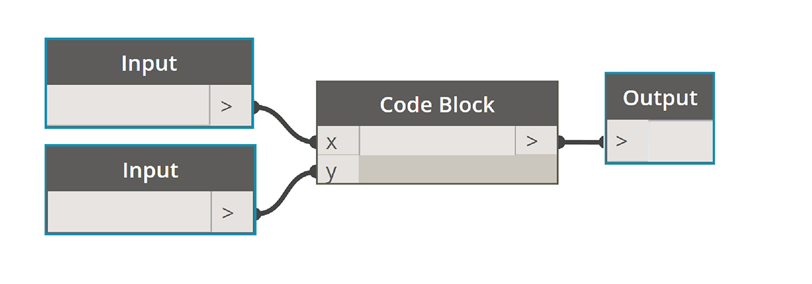
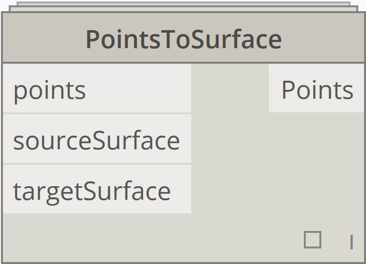
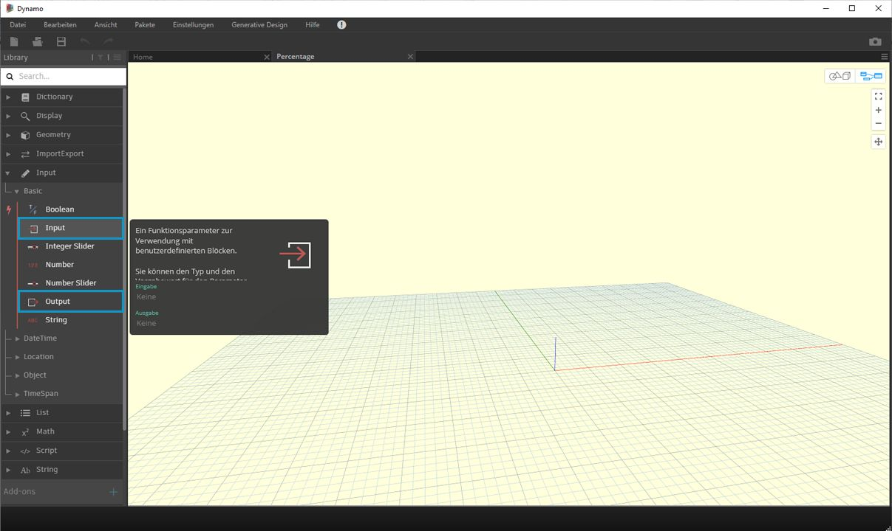
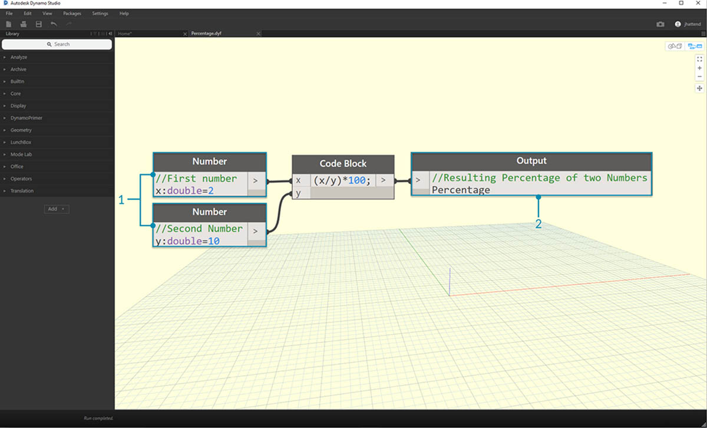
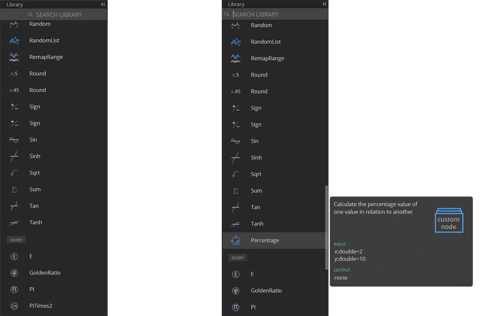

# Benutzerdefinierte Blöcke – Einführung

Dynamo bietet zahlreiche Core-Blöcke für eine Vielfalt von Aufgaben in der visuellen Programmierung. In manchen Fällen erhalten Sie jedoch schnellere, elegantere oder leichter weiterzugebende Lösungen, indem Sie Ihre eigenen Blöcke konstruieren. Diese können in verschiedenen Projekten wiederverwendet werden, tragen dazu bei, das Diagramm klarer und übersichtlicher zu gestalten, und können an den Package Manager übergeben und mit der globalen Dynamo-Community geteilt werden.

## Bereinigen des Diagramms

Benutzerdefinierte Blöcke werden durch Verschachteln anderer Blöcke und benutzerdefinierter Blöcke in einem benutzerdefinierten Dynamo-Block konstruiert. Dieser ist im Prinzip ein Container. Bei der Ausführung dieses Container-Blocks im Diagramm werden sämtliche darin enthaltenen Funktionen ausgeführt. Dies ermöglicht die Wiederverwendung und Weitergabe nützlicher Kombinationen von Blöcken.

## Übernehmen von Änderungen

Wenn mehrere Kopien eines benutzerdefinierten Blocks im Diagramm vorhanden sind, können Sie alle diese Kopien aktualisieren, indem Sie den zugrunde liegenden benutzerdefinierten Block aktualisieren. Dadurch können Sie das Diagramm nahtlos entsprechend eventuellen Änderungen in Ihrem Arbeitsablauf oder Entwurf aktualisieren.

## Arbeitsteilung

Zu den größten Vorteilen benutzerdefinierter Blöcke gehören wohl ihre Möglichkeiten zur Arbeitsteilung. Wenn ein "Power-User" ein komplexes Dynamo-Diagramm erstellt und dies an einen Designer weitergibt, der noch nicht mit Dynamo gearbeitet hat, kann er das Diagramm auf die wesentlichen, für die Interaktion erforderlichen Angaben komprimieren. Der benutzerdefinierte Block kann geöffnet werden, um das Diagramm in seinem Inneren zu bearbeiten, wobei der Container jedoch einfach bleibt. Benutzerdefinierte Blöcke ermöglichen auf diese Weise den Dynamo-Benutzern die Entwicklung klarer und intuitiver Diagramme.

## Zahlreiche Methoden zur Blockentwicklung

Zur Entwicklung benutzerdefinierter Blöcke in Dynamo steht eine große Vielfalt an Methoden zur Verfügung. In den Beispielen in diesem Kapitel erstellen Sie benutzerdefinierte Blöcke direkt in der Dynamo-Benutzeroberfläche. Wenn Sie Programmierer sind und Interesse an C# oder Zero-Touch-Formatierung haben, finden Sie auf [dieser Seite](https://github.com/DynamoDS/Dynamo/wiki/How-To-Create-Your-Own-Nodes) im Dynamo-Wiki eine genauere Erklärung.

## Umgebung für benutzerdefinierte Blöcke

Im Folgenden erstellen Sie in der Umgebung für benutzerdefinierte Blöcke einen einfachen Block zur Berechnung eines Prozentwerts. Die Umgebung für benutzerdefinierte Blöcke unterscheidet sich zwar von der Umgebung für Diagramme in Dynamo, die Interaktion läuft jedoch im Wesentlichen auf dieselbe Weise ab. Mit diesen Informationen können Sie damit beginnen, Ihren ersten benutzerdefinierten Block zu erstellen.

> Um einen neuen benutzerdefinierten Block zu erstellen, starten Sie Dynamo und wählen Sie Benutzerdefinierter Block oder geben Sie Strg + Umschalt + N im Ansichtsbereich ein.

> Weisen Sie im Dialogfeld Eigenschaften für benutzerdefinierten Block einen Namen, eine Beschreibung und eine Kategorie zu.

> 1. **Name**: Prozentsatz

1. **Beschreibung**: Berechnung des Prozentsatzes eines Werts relativ zu einem anderen.
2. **Kategorie**: Core.Math

> Dadurch wird ein Ansichtsbereich mit gelbem Hintergrund geöffnet, der darauf hinweist, dass Sie in einem benutzerdefinierten Block arbeiten. In diesem Ansichtsbereich haben Sie Zugriff auf alle Core-Blöcke von Dynamo sowie die Blöcke **Input** und **Output**, die zum Benennen der in den benutzerdefinierten Block und aus ihm heraus fließenden Daten dienen. Sie finden diese unter _Core > Input_.

> 1. **Eingaben**: Input-Blöcke erstellen die Eingaben des benutzerdefinierten Blocks. Verwenden Sie für einen Input-Block die folgende Syntax: _input\_name : datatype = default\_value(optional)_

1. **Ausgaben**: Diese Blöcke funktionieren ähnlich wie Input-Blöcke, dienen jedoch zum Erstellen und Benennen der Ausgaben des benutzerdefinierten Blocks. Es ist sinnvoll, den Ein- und Ausgaben **benutzerdefinierte Kommentare** hinzuzufügen, um den Typ der Ein- bzw. Ausgabe zu verdeutlichen. Dies wird im Abschnitt [Erstellen eines benutzerdefinierten Blocks](10-2\_creating.md) genauer beschrieben.

Sie können diesen benutzerdefinierten Block als DYF-Datei (im Gegensatz den Standard-DYN-Dateien) speichern. Er wird dann automatisch der laufenden und zukünftigen Sitzungen hinzugefügt. Der benutzerdefinierte Block befindet sich in der Bibliothek in der Kategorie, die Sie in seinen Eigenschaften angegeben haben.

> Links: Kategorie Core > Math der vorgegebenen Bibliothek. Rechts: Core > Math mit dem neuen benutzerdefinierten Block

## Weitere Schritte

Damit haben Sie Ihren ersten benutzerdefinierten Block erstellt. In den nächsten Abschnitten werden die Funktionen benutzerdefinierter Blöcke und die Veröffentlichung allgemeiner Arbeitsabläufe genauer betrachtet. Thema des folgenden Abschnitts ist die Entwicklung eines benutzerdefinierten Blocks, der Geometrie von einer Oberfläche auf eine andere überträgt.
