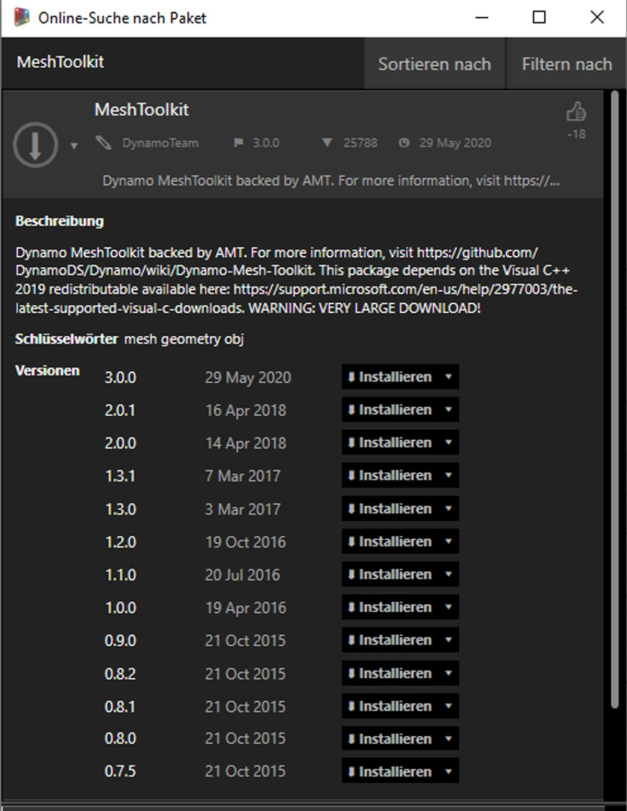
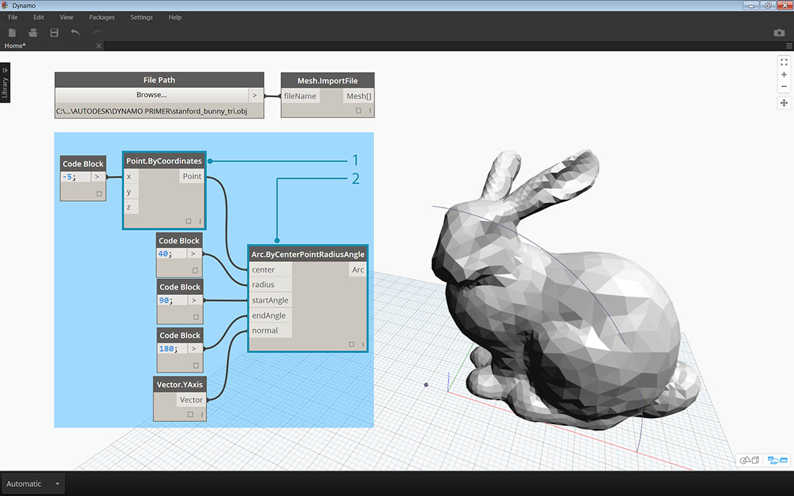

# Fallstudie zu Paketen: Mesh Toolkit

Das Dynamo Mesh Toolkit enthält Werkzeuge zum Importieren von Netzen aus externen Dateiformaten, zum Erstellen von Netzen aus Dynamo-Geometrieobjekten und zum manuellen Erstellen von Netzen aus ihren Scheitelpunkten und Indizes. In der Bibliothek stehen außerdem Werkzeuge zum Ändern oder Reparieren von Netzen sowie zum Extrahieren horizontaler Segmente zur Verwendung in der Fertigung zur Verfügung.

Das Dynamo Mesh Toolkit ist Bestandteil der von Autodesk durchgeführten laufenden Forschungsarbeiten zu Netzen und wird daher in den kommenden Jahren weiter ausgebaut. Sie können damit rechnen, dass häufig neue Methoden zu diesem Toolkit hinzukommen. Falls Sie Kommentare oder Vorschläge haben oder Fehler melden möchten, ist das Dynamo-Team jederzeit für Sie da.

## Netze und Volumenkörper im Vergleich

In der unten folgenden Übung werden einige grundlegende Operationen für Netze unter Verwendung von Mesh Toolkit gezeigt. In der Übung schneiden Sie ein Netz mit einer Folge von Ebenen. Wenn Sie hierfür Volumenkörper verwenden, kann dies sehr viel Rechenaufwand erfordern. Bei Netzen ist die "Auflösung" im Gegensatz zu Volumenkörpern festgelegt. Darüber hinaus werden Netze nicht mathematisch, sondern topologisch definiert und die Auflösung kann für die Zwecke der jeweiligen Aufgabe definiert werden. Weitere Informationen zum Verhältnis von Netzen und Volumenkörpern finden Sie im Kapitel [Geometrie für Computational Design](../5\_geometry-for-computational-design/) in diesem Leitfaden. Eine genauere Analyse von Mesh Toolkit finden Sie auf der [Dynamo-Wiki-Seite.](https://github.com/DynamoDS/Dynamo/wiki/Dynamo-Mesh-Toolkit) Die folgende Übung zeigt die Verwendung dieses Pakets.

## Installieren von Mesh Toolkit

> Wählen Sie in Dynamo in der Menüleiste oben _Pakete > Suchen nach Paket_. Geben Sie _MeshToolkit_ in das Suchfeld ein (in einem Wort und unter Berücksichtigung der Groß- und Kleinschreibung). Klicken Sie auf den Download-Pfeil für das zu Ihrer Version von Dynamo passende Paket. Dieser einfache Schritt genügt.

## Übungslektion

> Laden Sie die zu dieser Übungslektion gehörigen Beispieldateien herunter (durch Rechtsklicken und Wahl der Option Save Link As). Eine vollständige Liste der Beispieldateien finden Sie im Anhang. [MeshToolkit.zip](https://github.com/h-iL/ForkedDynamoPrimerReorganized/blob/de/11\_Packages/datasets/11-2/MeshToolkit.zip)

Öffnen Sie zunächst _Mesh-Toolkit\_Intersect-Mesh.dyn in Dynamo._ In diesem Beispiel verwenden Sie den Intersect-Block innerhalb von Mesh Toolkit. Sie importieren ein Netz und schneiden es mit einer Reihe eingegebener Ebenen, um Segmente zu erhalten. Davon ausgehend kann das Modell für die Fertigung auf einem Laser- oder Wasserstrahlwerkzeug oder einer CNC-Fräse vorbereitet werden.

> 1. **File Path**: Suchen Sie die zu importierende Netzdatei (_stanford\_bunny\_tri.obj_). Unterstützte Dateitypen sind .mix und .obj.

1. **Mesh.ImportFile**: Verbinden Sie den Dateipfad, um das Netz zu importieren.

> 1. **Point.ByCoordinates**: Legen Sie einen Punkt fest. Dieser wird als Mittelpunkt eines Bogens verwendet.

1. **Arc.ByCenterPointRadiusAngle**: Konstruieren Sie einen Bogen um den Punkt. Mithilfe dieser Kurve wird eine Reihe von Ebenen platziert.

> 1. Code Block: Erstellen Sie eine Reihe von Zahlen zwischen Null und Eins.

1. **Curve.PointAtParameter:** Verbinden Sie den Bogen mit der _curve_-Eingabe und die Ausgabe des Codeblocks mit der _param_-Eingabe, um eine Reihe von Punkten entlang der Kurve abzurufen.
2. **Curve.TangentAtParameter**: Verbinden Sie die Eingaben auf dieselbe Weise wie beim vorigen Block.
3. **Plane.ByOriginNormal:** Verbinden Sie die Punkte mit der _origin_-Eingabe und die Vektoren mit der _normal_-Eingabe, um eine Reihe von Ebenen an den einzelnen Punkten zu erstellen.

Damit sollte eine am Bogen entlang ausgerichtete Reihe von Ebenen angezeigt werden. Diese Ebenen verwenden Sie als Nächstes zum Schneiden des Netzes.

> 1. **Mesh.Intersect**: Schneiden Sie die Ebenen mit dem importierten Netz, sodass eine Reihe von Polykurvenkonturen entsteht.

1. **PolyCurve.Curves**: Teilen Sie die Polykurven in ihre Kurvenfragmente auf.
2. **Curve.EndPoint**: Extrahieren Sie die Endpunkte der einzelnen Kurven.
3. **NurbsCurve.ByPoints**: Konstruieren Sie mithilfe der Punkte eine Nurbs-Kurve. Schließen Sie die Kurven mithilfe eines Boolean-Blocks mit dem Wert _True_.

> 1. **Surface.ByPatch**: Konstruieren Sie Oberflächenfelder für die einzelnen Konturen, um das Netz in Segmente aufzuteilen.

> Fügen Sie eine zweite Segmentierung hinzu, um einen gitter- oder eierkartonähnlichen Effekt zu erzielen.

Ihnen ist vielleicht aufgefallen, dass die Schnittvorgänge für Netze schneller berechnet werden als für vergleichbare Volumenkörper. Arbeitsabläufe wie der in dieser Übung beschriebene eignen sich gut für die Arbeit mit Netzen.
