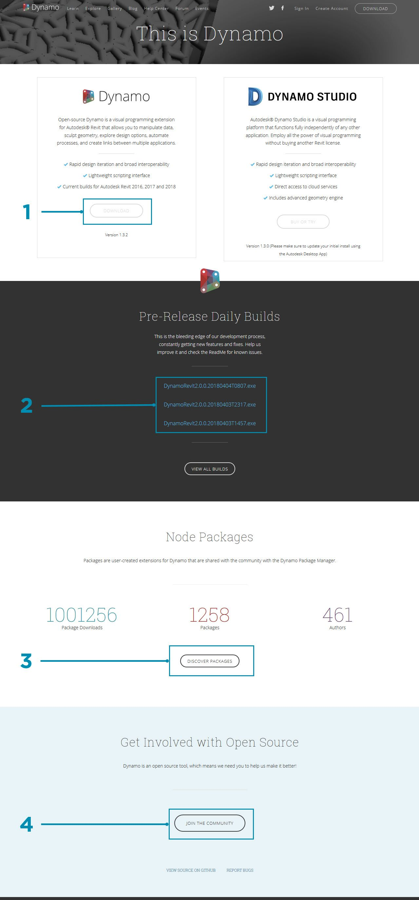
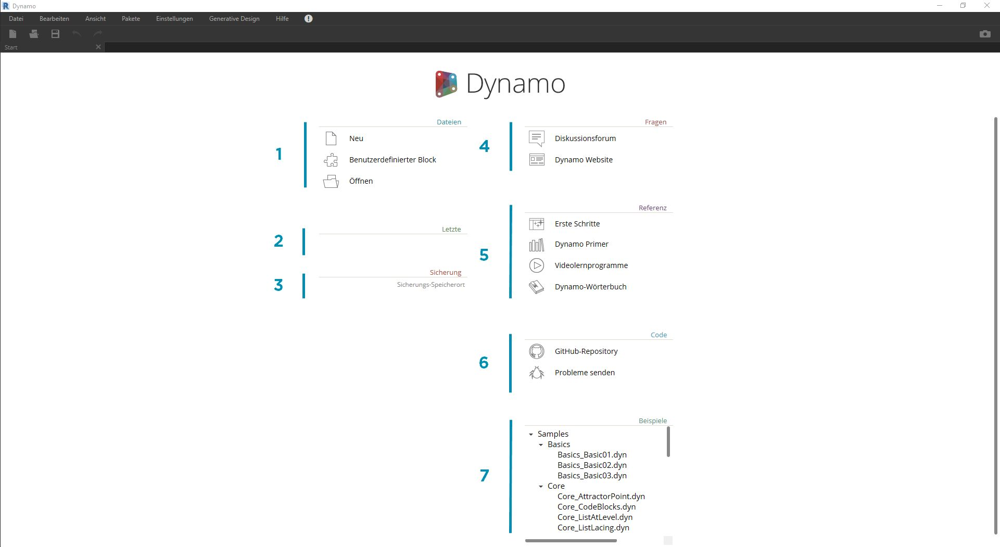

# Dynamo installieren und starten

Dynamo ist ein aktives Open-Source-Entwicklungsprojekt mit herunterladbaren Installationsprogrammen für offizielle und Vorab-Releases, d. h. "Daily Build". Laden Sie für den Einstieg die offizielle Version herunter, oder tragen Sie aktiv zur Entwicklung von Dynamo bei, indem Sie sich an den Builds des Tages oder dem Github-Projekt beteiligen.

## Herunterladen

Um das offizielle Release von Dynamo herunterzuladen, besuchen Sie die [Dynamo-Website](http://dynamobim.com). Starten Sie den Download unmittelbar über die Startseite oder durch Navigieren zur entsprechenden Download-Seite.

> 1. Video zur computergestützten Konstruktion mit Dynamo in der Architektur ansehen

1. Oder zur Download-Seite navigieren

Hier können Sie die aktuellen Entwicklungsversionen herunterladen oder zum [Dynamo Github](https://github.com/DynamoDS/Dynamo)-Projekt wechseln.

> 1. Installationsprogramm für das offizielle Release herunterladen

1. Installationsprogramme für Daily Builds herunterladen
2. Benutzerdefinierte Anwendungen aus der Entwickler-Community auschecken
3. Sich an der Entwicklung von Dynamo auf Github beteiligen

## Installieren

Navigieren Sie zum Verzeichnis des heruntergeladenen Installationsprogramms, und führen Sie die ausführbare Datei aus. Während des Installationsprozesses können Sie die Komponenten anpassen, die installiert werden.

> 1. Zu installierende Komponenten auswählen

Hier müssen Sie entscheiden, ob Sie die Komponenten einschließen möchten, die Dynamo mit anderen installierten Anwendungen wie Revit verbinden. Weitere Informationen zur Dynamo-Plattform finden Sie in **Kapitel 1.2**.

## Starten

Um Dynamo zu starten, navigieren Sie zu \Programme\Dynamo\Dynamo Revit\x.y und wählen Sie dann DynamoSandbox.exe. Dadurch wird die eigenständige Version geöffnet und die _Startseite_ von Dynamo angezeigt. Auf dieser Seite werden die Standardmenüs und der Werkzeugkasten sowie eine Reihe von Verknüpfungen angezeigt, die den Zugriff auf Dateifunktionen und zusätzliche Ressourcen ermöglichen.

> 1. Dateien: Neue Datei erstellen oder vorhandene Datei öffnen

1. Letzte: Liste der zuletzt verwendeten Dateien
2. Backup: Zugriff auf Ihre Sicherungsdateien
3. Fragen: Für direkten Zugriff auf das Benutzerforum oder die Dynamo-Website
4. Referenz: Vertiefung mithilfe zusätzlicher Schulungsressourcen
5. Code: Zur Beteiligung am Open-Source-Entwicklungsprojekt
6. Beispiele: Beispiele austesten, die im Lieferumfang der Installation enthalten sind

Öffnen Sie die erste Beispieldatei, um Ihren ersten Arbeitsbereich zu erstellen und zu bestätigen, dass Dynamo ordnungsgemäß ausgeführt wird. Klicken Sie auf Beispiele > Grundlagen > **Basics\_Basic01.dyn**.

> 1. Stellen Sie sicher, dass in der Ausführungsleiste "Automatisch" angezeigt wird, oder klicken Sie auf Ausführen.

1. Folgen Sie den Anweisungen und verbinden Sie den Block **Number** mit dem Block **+**.
2. Bestätigen Sie, dass dieser Watch-Block ein Ergebnis anzeigt.

Wenn diese Datei erfolgreich geladen wird, sollten Sie in der Lage sein, Ihr erstes visuelles Programm mit Dynamo auszuführen.
