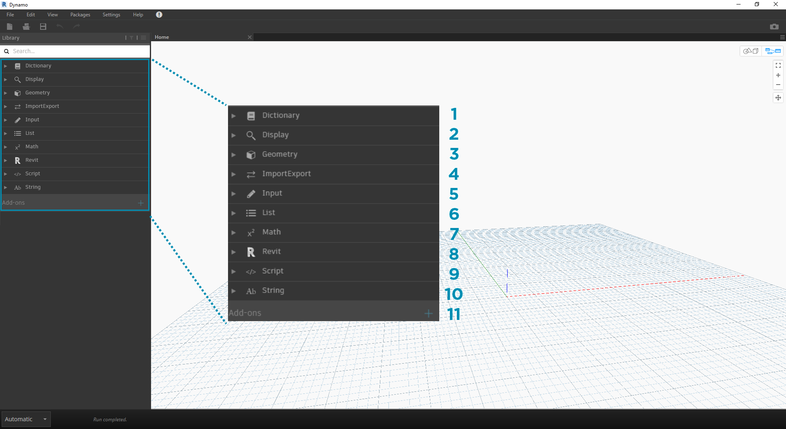

# Die Benutzeroberfläche

Die Benutzeroberfläche (UI) von Dynamo weist fünf Hauptbereiche auf, von denen der größte der Arbeitsbereich ist, in dem Sie Ihre visuellen Programme erstellen.

> 1. Menüs

1. Werkzeugkasten
2. Bibliothek
3. Arbeitsbereich
4. Ausführungsleiste

Machen Sie sich genauer mit der Benutzeroberfläche vertraut, und untersuchen Sie die Funktionalität der einzelnen Bereiche.

### Menüs

In den Dropdown-Menüs können Sie einige der grundlegenden Funktionen der Dynamo-Anwendung aufrufen. Wie in fast jeder anderen Windows-Software finden Sie die Aktionen zum Verwalten von Dateien sowie Operationen zum Auswählen und Bearbeiten von Inhalten in den ersten beiden Menüs. Die übrigen Menüs sind spezifisch für Dynamo.

> 1. Datei

1. Bearbeiten
2. Ansicht
3. Pakete
4. Einstellungen
5. Hilfe
6. Benachrichtigungen

### Werkzeugkasten

Der Werkzeugkasten von Dynamo enthält eine Reihe von Schaltflächen für den Schnellzugriff zum Arbeiten mit Dateien sowie die Befehle Rückgängig \[Ctrl + Z] und Wiederholen \[Ctrl + Y]. Ganz rechts befindet sich eine weitere Schaltfläche, über die Sie einen Snapshot des Arbeitsbereichs exportieren können. Dies ist für die Dokumentation und die gemeinsame Bearbeitung mit anderen äußerst nützlich.

> 1. Neu: Neue .dyn-Datei erstellen

1. Öffnen: Vorhandene .dyn-Datei (Arbeitsbereich) oder .dyf-Datei (benutzerdefinierter Block) öffnen
2. Speichern/Speichern unter: Aktive .dyn- oder .dyf-Datei speichern
3. Rückgängig: Die letzte Aktion rückgängig machen
4. Wiederholen: Die nächste Aktion wiederherstellen
5. Arbeitsbereich als Bild exportieren: Den angezeigten Arbeitsbereich als PNG-Datei exportieren

### Bibliothek

Die Bibliothek enthält alle geladenen Blöcke, einschließlich der vorgabemäßigen Blöcke, die zum Lieferumfang gehören, sowie der zusätzlich geladenen benutzerdefinierten Blöcke und Pakete. Die Blöcke in der Bibliothek sind in Abhängigkeit davon, ob die Blöcke Daten **erstellen**, eine **Aktion** ausführen oder Daten **abfragen**, hierarchisch in Bibliotheken, Kategorien und ggf. Unterkategorien geordnet.

#### Durchsuchen

Standardmäßig enthält die **Bibliothek** acht Kategorien von Blöcken. Am besten untersuchen Sie zunächst die Kategorien **Core** und **Geometry**, da sie die größte Anzahl an Blöcken enthalten. Das Durchsuchen dieser Kategorien stellt die schnellste Möglichkeit dar, um die Hierarchie dessen zu verstehen, was Sie zu Ihrem Arbeitsbereich hinzufügen können, und um neue Blöcke zu entdecken, die Sie niemals zuvor verwendet haben.

> Konzentrieren Sie sich zunächst auf die Standardsammlung an Blöcken. Beachten Sie, dass Sie diese Bibliothek später um benutzerdefinierte Blöcke, zusätzliche Bibliotheken und den Package Manager erweitern werden.

> 1. Wörterbuch

1. Anzeige
2. Geometrie
3. Import/Export
4. Eingabeblöcke (Input)
5. Liste
6. Übereinstimmungen
7. Revit
8. Skript
9. Zeichenfolge
10. Add-ons

Durchsuchen Sie die Bibliothek, indem Sie durch die Menüs klicken. Klicken Sie auf Geometry > Curves > Circle. Beachten Sie den neuen Abschnitt des Menüs, der eingeblendet wird, insbesondere die Bezeichnungen **Erstellen** und **Abfrage**.

> 1. Bibliothek

1. Kategorie
2. Unterkategorie: Erstellen/Aktionen/Abfrage
3. Block
4. Blockbeschreibung und -eigenschaften: Wird angezeigt, wenn Sie den Cursor auf das Blocksymbol bewegen.

Bewegen Sie den Cursor im Menü Circle auf **ByCenterPointRadius**. Das daraufhin angezeigte Fenster enthält über den Namen und das Symbol hinaus noch weitere detaillierte Informationen zu dem Block. Dadurch können Sie schnell nachvollziehen, welche Aktion der Block ausführt, welche Eingaben erforderlich sind und was von dem Block ausgegeben wird.

> 1. Beschreibung: Kurze Beschreibung des Blocks

1. Symbol: Größere Version des Symbols im Menü Bibliothek
2. Eingabe(n): Name, Datentyp und Datenstruktur
3. Ausgabe(n): Datentyp und Struktur

#### Suchen

Wenn Sie relativ genau wissen, welchen Block Sie zu Ihrem Arbeitsbereich hinzufügen möchten, können Sie das Feld **Suchen** verwenden. Solange Sie keine Einstellungen bearbeiten oder Werte im Arbeitsbereich angeben, befindet sich der Cursor in diesem Feld. Sobald Sie etwas in das Feld eingeben, werden in der Dynamo-Bibliothek die beste Übereinstimmung (mit Breadcrumbs dafür, wo der Suchbegriff in den Blockkategorien gefunden werden kann) und eine Liste alternativer Übereinstimmungen der Suche angezeigt. Wenn Sie die Eingabetaste drücken oder im eingeschränkten Browser auf das Element klicken, wird der hervorgehobene Block in der Mitte des Arbeitsbereichs hinzugefügt.

> 1. Suchfeld

1. Am besten übereinstimmendes Ergebnis/Ausgewählt
2. Alternative Übereinstimmungen

## Einstellungen

Im Menü **Einstellungen** sind sowohl geometrische als auch Benutzereinstellungen verfügbar. Hier können Sie auch die Freigabe Ihrer Benutzerdaten zur Verbesserung von Dynamo aktivieren bzw. deaktivieren sowie die Anzahl an Dezimalstellen und die Renderqualität der Geometrie definieren.

> 1. Berichte aktivieren: Optionen zur Weitergabe von Benutzerdaten für die Verbesserung von Dynamo.

1. Vorschau von Ausführung anzeigen: Zeigt den Ausführungszustand des Diagramms als Vorschau an. Blöcke, die zur Ausführung geplant sind, werden im Diagramm hervorgehoben.
2. Optionen für das Zahlenformat: Ändern der Dokumenteinstellungen für Dezimalstellen.
3. Rendergenauigkeit: Einstellen einer höheren oder niedrigen Renderqualität.
4. Skalierung für Geometrie: Bereich der Geometrie, an der Sie gerade arbeiten.
5. Ausgewählte Geometrie isolieren: Hintergrundgeometrie basierend auf den Blöcken auswählen.
6. Geometriekanten anzeigen/ausblenden: Ein- oder Ausblenden von 3D-Geometriekanten.
7. Vorschaufenster anzeigen/ausblenden: Ein- oder Ausblenden der Datenvorschaufenster.
8. Pfade für Blöcke und Pakete verwalten: Verwalten der Dateipfade, damit Blöcke und Pakete in der Bibliothek angezeigt werden.
9. Experimentelle Funktionen aktivieren: Verwenden neuer Beta-Funktionen in Dynamo.

## Hilfe

Wenn Sie nicht weiterkommen, verwenden Sie das Menü **Hilfe**. Hier finden Sie die Beispieldateien, die zum Lieferumfang Ihrer Installation gehören, und können in Ihrem Internet-Browser auf eine der Referenz-Websites von Dynamo zugreifen. Falls erforderlich, können Sie über die Option **Info** überprüfen, welche Version von Dynamo installiert ist und ob sie aktuell ist.

> 1. Erste Schritte: eine kurze Einführung in die Verwendung von Dynamo.

1. Beispiele: Beispieldateien als Referenz.
2. Dynamo-Wörterbuch öffnen: Ressource mit Dokumentation für alle Blöcke.
3. Fehler melden: Melden Sie ein Problem auf GitHub.
4. Wechseln zu Projekt-Website: Zeigen Sie das Dynamo-Projekt auf GitHub an.
5. Zu Projekt-Wiki wechseln: Im Wiki erhalten Sie Entwicklungsinformationen mithilfe der Dynamo-API, unterstützenden Bibliotheken und Tools.
6. Startseite anzeigen: Kehren Sie von einem Dokument aus zur Dynamo-Startseite zurück.
7. Info: Angaben zur Version von Dynamo.
