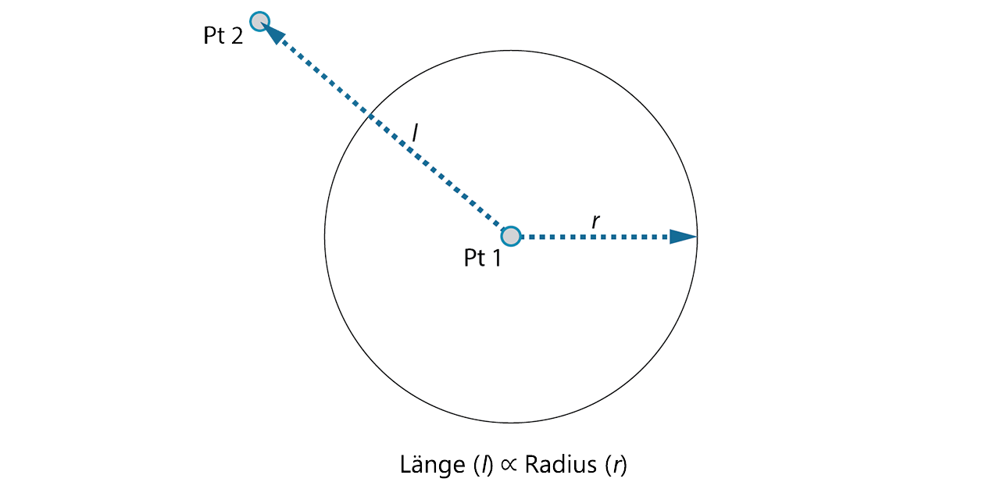
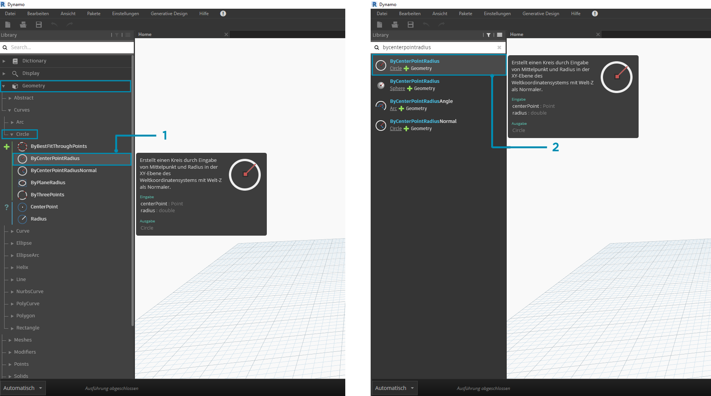

# Erste Schritte

Nachdem Sie sich mit dem Layout der Benutzeroberfläche und dem Navigieren im Arbeitsbereich vertraut gemacht haben, wird in diesem Abschnitt ein typischer Arbeitsablauf für die Entwicklung eines Diagramms in Dynamo erläutert. Sie erstellen zunächst einen Kreis mit einer dynamischen Größe und dann eine Reihe von Kreisen mit unterschiedlichen Radien.

## Ziele und Beziehungen definieren

Bevor Sie etwas zum Dynamo-Arbeitsbereich hinzufügen, ist es von grundlegender Bedeutung, ein klares Verständnis dafür zu entwickeln, was erreicht werden soll und welche Beziehungen dafür wichtig sind. Denken Sie daran, dass bei jedem Verbinden von zwei Blöcken eine explizite Verknüpfung zwischen ihnen erstellt wird. Sie können den Datenfluss zu einem späteren Zeitpunkt ändern, aber sobald eine Verbindung hergestellt wurde, ist die Beziehung festgelegt. In dieser Übung erstellen Sie einen Kreis (_Ziel_), dessen Radius durch die Entfernung zu einem nahegelegenen Punkt (_Beziehung_) definiert wird.

> Ein Punkt, der eine entfernungsabhängige Beziehung definiert, wird häufig als "Attraktor" bezeichnet. In diesem Beispiel wird die Entfernung zum Attraktorpunkt verwendet, um anzugeben, wie groß der Kreis sein soll.

## Blöcke zum Arbeitsbereich hinzufügen

Nachdem Sie die Ziele und Beziehungen skizziert haben, können Sie mit dem Erstellen des Diagramms beginnen. Sie benötigen die Blöcke, die die Reihenfolge der Aktionen darstellen, die von Dynamo ausgeführt werden. Da Sie einen Kreis erstellen möchten, suchen Sie nach einem Block, der diese Aktion ausführt. Über das Suchfeld oder durch Durchsuchen der Bibliothek werden Sie feststellen, dass es zum Erstellen eines Kreises mehrere Möglichkeiten gibt.

> 1. Navigieren Sie zu Geometry > Circle > **Circle.ByPointRadius**.

1. Suchen Sie nach > "ByCenterPointRadius..."

Fügen Sie den Block **Circle.ByPointRadius** zum Arbeitsbereich hinzu, indem Sie in der Bibliothek darauf klicken. Dadurch wird der Block in der Mitte des Arbeitsbereichs hinzugefügt.

> 1. Der Block Circle.ByPointandRadius in der Bibliothek

1. Durch Klicken auf den Block in der Bibliothek wird er zum Arbeitsbereich hinzugefügt.

Darüber hinaus benötigen Sie die Blöcke **Point.ByCoordinates**, **Number Input** und **Number Slider**.

> 1. Geometry > Points > Point > **Point.ByCoordinates**

1. Geometry > Geometry > **DistanceTo**
2. Input > Basic > **Number**
3. Input > Basic > **Number Slider**

## Blöcke mit Drähten verbinden

Nachdem Sie mehrere Blöcke zum Arbeitsbereich hinzugefügt haben, müssen Sie die Anschlüsse der Blöcke mit Drähten verbinden. Diese Verbindungen definieren den Datenfluss.

> 1. **Number** zu **Point.ByCoordinates**

1. **Number Sliders** zu **Point.ByCoordinates**
2. **Point.ByCoordinates** (2) zu **DistanceTo**
3. **Point.ByCoordinates** und **DistanceTo** zu **Circle.ByCenterPointRadius**

## Programm ausführen

Nachdem Sie den Programmablauf definiert haben, müssen Sie Dynamo noch mitteilen, wie es ausgeführt werden soll. Wenn das Programm ausgeführt wird (entweder automatisch oder durch Klicken auf Ausführen im manuellen Modus), werden Daten über die Drähte übertragen und die Ergebnisse in der 3D-Vorschau angezeigt.

> 1. (Auf Ausführen klicken): Wenn sich die Ausführungsleiste im manuellen Modus befindet, muss auf Ausführen geklickt werden, um das Diagramm auszuführen.

1. Blockvorschau: Durch Verschieben des Mauszeigers auf das Feld in der rechten unteren Ecke eines Blocks wird ein Popup-Fenster mit den Ergebnissen angezeigt.
2. 3D-Vorschau: Wenn einer der verfügbaren Blöcke Geometrie erzeugt, wird eine 3D-Vorschau angezeigt.
3. Die Ausgabe von Geometrie im Erstellungsblock.

## Details hinzufügen

Wenn das Programm ordnungsgemäß funktioniert, wird in der 3D-Vorschau ein Kreis angezeigt, der durch den Attraktorpunkt verläuft. Anschließend können Sie weitere Details oder Steuerelemente hinzufügen. Passen Sie die Eingabe für den Kreis-Block an, um den Einfluss auf den Radius zu kalibrieren. Fügen Sie einen weiteren **Number Slider**-Block zum Arbeitsbereich hinzu, und doppelklicken Sie auf einen leeren Bereich im Arbeitsbereich, um einen **Code Block**-Block hinzuzufügen. Bearbeiten Sie das Feld im Code Block-Block, indem Sie `X/Y` angeben.

> 1. **Code Block**

1. **DistanceTo** und **Number Slider** zu **Code Block**
2. **Code Block** zu **Circle.ByCenterPointRadius**

## Komplexität hinzufügen

Einfach zu beginnen und dann die Komplexität zu erhöhen stellt eine effektive Möglichkeit dar, Programme schrittweise zu entwickeln. Wenn das Programm also für einen Kreis funktioniert, können Sie es auch für mehrere Kreise ausführen. Wenn Sie anstelle eines Mittelpunkts ein Raster an Punkten verwenden und diese Änderung in der resultierenden Datenstruktur umsetzen, werden von Ihrem Programm viele Kreise erzeugt, jeder mit einem eindeutigen Radiuswert, der durch die kalibrierte Entfernung zum Attraktorpunkt definiert wird.

> 1. Fügen Sie einen **Number Sequence**-Block hinzu und ersetzen Sie die Eingaben von **Point.ByCoordinates**: Klicken Sie mit der rechten Maustaste auf Point.ByCoordinates und wählen Sie Vergitterung > Kreuzprodukt.

1. Fügen Sie einen **Flatten**-Block nach Point.ByCoordinates hinzu. Zum vollständigen Abflachen einer Liste belassen Sie Vorgabeeinstellung von `amt` auf `-1`.
2. Die 3D-Vorschau wird mit einem Raster von Kreisen aktualisiert.

## Mit Direktbearbeitung anpassen

In manchen Fällen ist die numerische Bearbeitung nicht der richtige Ansatz. Jetzt können Sie beim Navigieren in der Hintergrund-3D-Vorschau Punktgeometrie manuell drücken und ziehen. Sie können auch andere Geometrie steuern, die durch einen Punkt konstruiert wurde. **Sphere.ByCenterPointRadius** kann beispielsweise ebenfalls direkt bearbeitet werden. Sie können die Position eines Punkts aus einer Reihe von X-, Y- und Z-Werten mit **Point.ByCoordinates** steuern. Mit dem Direktbearbeitungsansatz sind Sie jedoch in der Lage, die Werte der Schieberegler zu aktualisieren, indem Sie den Punkt im Modus **Navigation in 3D-Vorschau** manuell verschieben. Dieser Ansatz bietet eine intuitivere Methode zum Steuern von mehreren diskreten Werten, die eine Punktposition identifizieren.

> 1. Um die **Direktbearbeitung** zu verwenden, wählen Sie die Gruppe mit dem zu verschiebenden Punkt aus – über dem ausgewählten Punkt werden Pfeile angezeigt.

1. Wechseln Sie in den Modus **Navigation in 3D-Vorschau**.

> 1. Wenn Sie den Cursor über den Punkt bewegen, werden die X -, Y - und Z-Achsen angezeigt.

1. Klicken Sie, und ziehen Sie den farbigen Pfeil, um die entsprechende Achse zu verschieben. Die **Number Slider**-Werte werden live mit dem manuell verschobenen Punkt aktualisiert.

> 1. Beachten Sie, dass vor der **Direktbearbeitung** nur ein Schieberegler an die **Point.ByCoordinates**-Komponente angeschlossen war. Wenn Sie den Punkt manuell in X-Richtung verschieben, erstellt Dynamo automatisch einen neuen **Number Slider** für die X-Eingabe.
