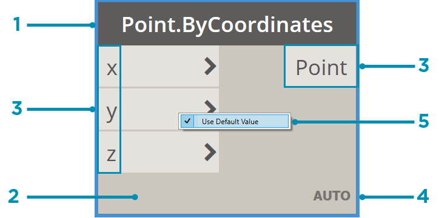

# Blöcke

In Dynamo stellen **Blöcke** die Objekte dar, die zum Bilden eines visuellen Programms miteinander verbunden werden. Jeder **Block** führt einen Vorgang aus – vom einfachen Speichern einer Zahl bis hin zu komplexen Aktionen wie das Erstellen oder Abfragen von Geometrie.

## Anatomie von Blöcken

In Dynamo setzen sich die meisten Blöcke aus fünf Teilen zusammen. Abgesehen von einigen Ausnahmen (z. B. Eingabeblöcke) kann die Anatomie eines jeden Blocks wie folgt beschrieben werden: 

> 1. Name: Der Name des Blocks gemäß Category.Name-Benennungskonvention

1. Hauptbereich: Der Hauptkörper des Blocks. Durch Klicken mit der rechten Maustaste auf diesen Bereich werden Optionen für den gesamten Block angezeigt.
2. Anschlüsse (eingehend und ausgehend): Die Rezeptoren für Drähte, über die die eingegebenen Daten sowie die Ergebnisse von Blockaktionen an Blöcke geliefert werden.
3. Symbol Vergitterung: Zeigt die für die Zuordnung von Listeneingaben angegebene Vergitterungsoption an (mehr dazu später).
4. Vorgabewert: Klicken Sie mit der rechten Maustaste auf einen Eingabeanschluss. Einige Blöcke verfügen über Vorgabewerte, die verwendet werden können, aber nicht verwendet werden müssen.

## Anschlüsse

Die Eingaben und Ausgaben für Blöcke werden als Anschlüsse bezeichnet. Sie fungieren als Kontakte für Drähte. Daten gelangen über die Anschlüsse auf der linken Seite in Blöcke und strömen auf der rechten Seite wieder aus den Blöcken hinaus, nachdem der entsprechende Vorgang ausgeführt wurde. Anschlüsse erwarten Daten eines bestimmten Typs. Das Verbinden einer Zahl wie _2,75_ mit den Anschlüssen eines Point By Coordinates-Blocks führt beispielsweise dazu, dass ein Punkt erfolgreich erstellt wird. Wenn jedoch _"Rot"_ an denselben Anschluss geliefert wird, tritt ein Fehler auf.

> Tipp: Bewegen Sie den Cursor auf einen Anschluss, um eine QuickInfo mit dem erwarteten Datentyp aufzurufen.

> 1. Anschlussbezeichnung

1. QuickInfo
2. Datentyp
3. Vorgabewert

## Status

Dynamo gibt einen Hinweis auf den Status der Ausführung eines visuellen Programms aus, indem Blöcke mit unterschiedlichen Farbschemata basierend auf dem Status der einzelnen Blöcke gerendert werden. Darüber hinaus werden durch Bewegen des Cursors auf den Namen bzw. die Anschlüsse oder durch Klicken mit der rechten Maustaste darauf zusätzliche Informationen und Optionen angezeigt.

> 1. Aktiv: Blöcke, deren Namen einen dunkelgrauen Hintergrund aufweisen, sind ordnungsgemäß angeschlossen, d. h., alle Eingaben konnten erfolgreich verbunden werden.

1. Inaktiv: Graue Blöcke sind inaktiv und müssen mit Drähten verbunden werden, um in den Programmablauf im aktiven Arbeitsbereich integriert zu werden.
2. Fehlerstatus: Rot weist auf einen Fehlerstatus des Blocks hin.
3. Anhalten: Bei transparent dargestellten Blöcken ist Anhalten aktiviert, d. h., ihre Ausführung wurde unterbrochen.
4. Ausgewählt: Aktuell ausgewählte Blöcke weisen eine aquamarinblau hervorgehobenen Rand auf.
5. Warnung: Gelb markierte Blöcke befinden sich im Warnzustand, d. h., sie enthalten eventuell die falschen Datentypen.
6. Hintergrundvorschau: Dunkelgrau bedeutet, dass die Geometrievorschau deaktiviert ist.

Wenn Ihr visuelles Programm Warnungen oder Fehler aufweist, gibt Dynamo zusätzliche Informationen zu dem Problem an. Alle Blöcke, die in gelb angezeigt werden, verfügen auch über eine QuickInfo über dem Namen. Bewegen Sie den Cursor auf die QuickInfo, um sie zu erweitern.

> Tipp: Untersuchen Sie vor dem Hintergrund dieser QuickInfo die vorgelagerten Blöcke, um zu sehen, ob der erforderliche Datentyp oder die erforderliche Datenstruktur fehlerhaft ist.

> 1. QuickInfo zu Warnung: "Null" oder keine Daten können nicht als Double verstanden werden, d. h. eine Zahl.

1. Verwenden Sie den Watch-Block, um die Eingabedaten zu untersuchen.
2. Der vorgelagerte Number-Block speichert "Rot", keine Zahl.
