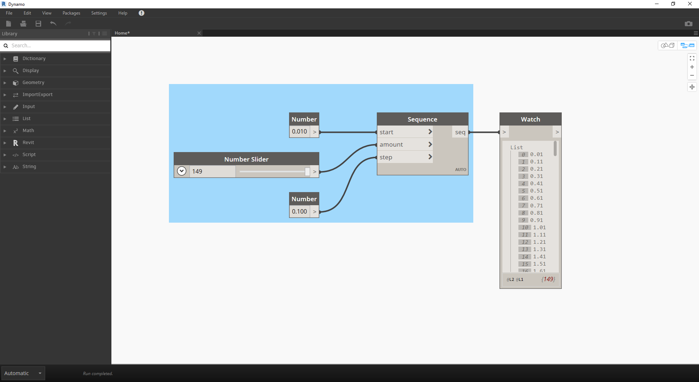
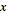
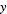
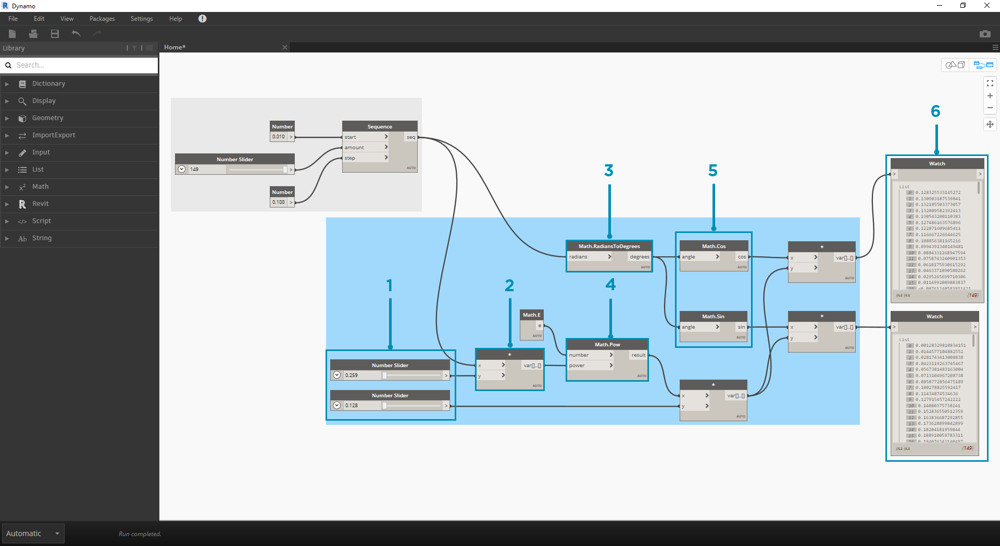
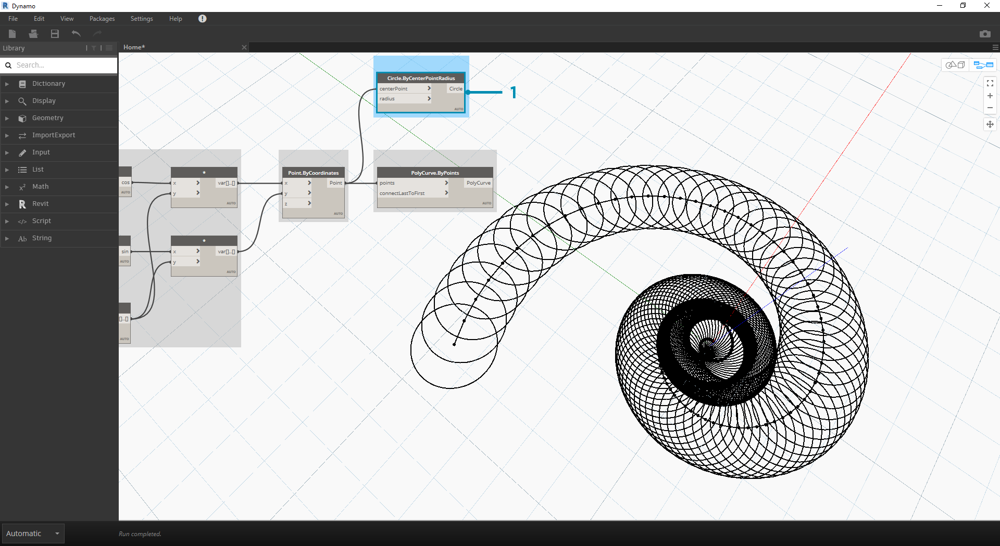
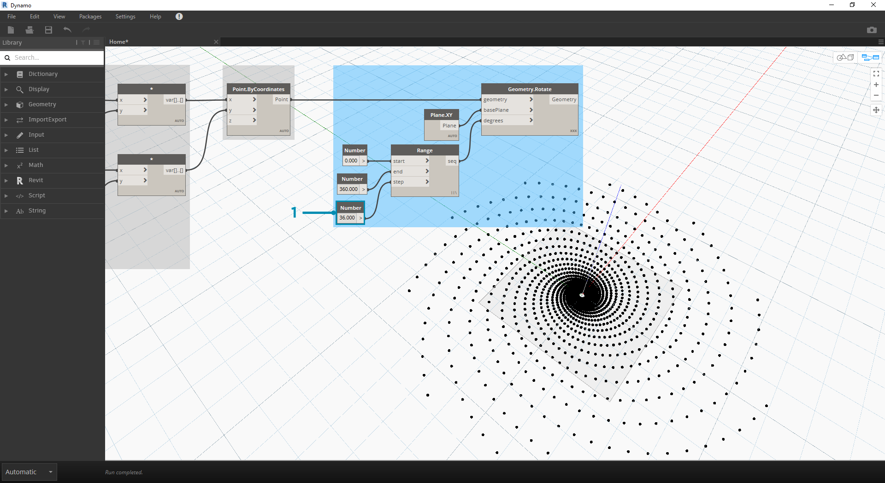

# Mathematische Operatoren

Zahlen stellen die einfachste Form von Daten dar und sind am einfachsten durch mathematische Operationen zu verknüpfen. Von einfachen Operatoren etwa zur Division über trigonometrische Funktionen bis hin zu komplexen Formeln: Mathematische Operationen eignen sich ausgezeichnet zur Analyse von Zahlenverhältnissen und -mustern.

## Arithmetische Operatoren

Operatoren sind Komponenten für algebraische Funktionen, die zwei Eingabewerte benötigen, um einen Ausgabewert zu erhalten (etwa bei der Addition, Subtraktion, Multiplikation, Division usw.). Sie finden die Operatoren unter Operators > Actions.

| Symbol                                | Name           | Syntax | Eingaben                   | Ausgaben     |
| ------------------------------------- | -------------- | ------ | -------------------------- | ------------ |
|  | Addition       | +      | var\[]...\[], var\[]...\[] | var\[]...\[] |
|  | Subtraktion    | -      | var\[]...\[], var\[]...\[] | var\[]...\[] |
|  | Multiplikation | \*     | var\[]...\[], var\[]...\[] | var\[]...\[] |
|  | Division       | /      | var\[]...\[], var\[]...\[] | var\[]...\[] |

## Parametrische Formeln

> Laden Sie die Beispieldatei für diese Übungslektion herunter (durch Rechtsklicken und Wahl von "Save Link As..."): \[Building Blocks of Programs - Math.dyn]\(datasets/4-2/Building Blocks of Programs - Math.dyn). Eine vollständige Liste der Beispieldateien finden Sie im Anhang.

Es ist logisch, im nächsten Schritt Operatoren und Variable in **Formeln** zu kombinieren, um komplexere Beziehungen zu erstellen. In diesem Beispiel erstellen Sie eine Formel, die durch Eingabeparameter, z. B. über Schieberegler, gesteuert werden kann.

> 1. **Sequence**: Definieren Sie eine Zahlenfolge mithilfe von drei Eingaben: _start, amount_ und _step_. Diese Folge steht für die Angabe "t" in der parametrischen Gleichung. Sie benötigen daher eine Liste mit genügend Werten zum Definieren einer Spirale.

Mit dem oben beschriebenen Schritt haben Sie eine Liste von Zahlen erstellt, die die parametrische Domäne definieren. Die Goldene Spirale ist durch die Gleichungen = und = definiert. Die unten gezeigte Gruppe von Blöcken zeigt die Darstellung dieser Gleichung in visueller Programmierung.

> Beachten Sie bei der Betrachtung dieser Blockgruppe die Entsprechungen zwischen dem visuellen Programm und der schriftlichen Gleichung.

> 1. **Number Slider**: Fügen Sie im Ansichtsbereich zwei Zahlen-Schieberegler ein. Diese Schieberegler steuern die Variablen _a_ und _b_ in der parametrischen Gleichung. Sie stehen für einstellbare Konstanten bzw. Parameter, die Sie anpassen können, um das gewünschte Ergebnis zu erhalten.

1. \*\*\*\*\*: Der Block für die Multiplikation wird mit einem Asterisk dargestellt. Er kommt hier mehrmals zum Einsatz, um Variable miteinander zu multiplizieren.
2. **Math.RadiansToDegrees:** Die Werte für "_t_" müssen in Grad umgewandelt werden, damit sie in den trigonometrischen Funktionen verwendet werden können. Dynamo verwendet per Vorgabe Grad zur Auswertung dieser Funktionen.
3. **Math.Pow**: Als Funktion von "_t_" und der Zahl "_e_" erstellt dieser Block die Fibonacci-Folge.
4. **Math.Cos und Math.Sin**: Diese beiden trigonometrischen Funktionen differenzieren die x- und y-Koordinaten der einzelnen parametrischen Punkte.
5. **Watch**: Als Ausgabe erhalten Sie zwei Listen mit Werten für die _x_- und _y_-Koordinaten der Punkte, aus denen die Spirale erstellt wird.

## Erstellen von Geometrie aus der Formel

Die Gruppe von Blöcken aus dem letzten Schritt funktioniert einwandfrei, erfordert jedoch erheblichen Aufwand. Einen effizienteren Arbeitsablauf finden Sie unter **Codeblöcke** (Abschnitt 3.3.2.3). Dort wird beschrieben, wie Sie eine Reihe von Dynamo-Ausdrücken in ein und demselben Block definieren können. In den nächsten Schritten zeichnen Sie mithilfe der parametrischen Gleichung die Fibonacci-Spirale. .png>)

> 1. **Point.ByCoordinates:** Verbinden Sie den oberen Multiplikationsblock mit der _x_-Eingabe und den unteren mit der _y_-Eingabe. Dadurch wird auf dem Bildschirm eine parametrische Spirale aus Punkten angezeigt.

> 1. **Polycurve.ByPoints**: Verbinden Sie Point.ByCoordinates aus dem vorigen Schritt mit _points_. Für _connectLastToFirst_ wird keine Eingabe benötigt, da Sie keine geschlossene Kurve erstellen. Dadurch wird eine durch die im vorigen Schritt erstellten Punkte verlaufende Spirale erstellt.

Damit haben Sie die Fibonacci-Spirale erstellt. Dies entwickeln Sie in zwei weiteren Übungen weiter, die hier als "Nautilus" und "Sonnenblume" bezeichnet werden. Dabei handelt es sich um Abstraktionen aus Systemen, die in der Natur vorkommen und gute Beispiele für zwei verschiedene Verwendungsweisen der Fibonacci-Spirale darstellen.

## Von der Spirale zum Nautilus

.png>)

> 1. Beginnen Sie mit demselben Schritt wie in der vorigen Übung, d. h., indem Sie mithilfe des **Point.ByCoordinates**-Blocks ein spiralförmiges Array aus Punkten erstellen.

> 1. **Polycurve.ByPoints**: Auch dieser Block wurde in der vorigen Übung verwendet. Er dient hier als Referenz.

1. **Circle.ByCenterPointRadius**: Verwenden Sie hier einen Circle-Block mit denselben Eingaben wie im vorigen Schritt. Als Radius ist der Wert _1.0_ vorgegeben, d. h., Sie sehen sofort die ausgegebenen Kreise. Die zunehmende Entfernung der Punkte vom Ursprung ist sofort ersichtlich.

> 1. **Circle.ByCenterPointRadius**: Um das Array aus Kreisen dynamischer zu gestalten, verbinden Sie die ursprüngliche Zahlenfolge (die Folge der "_t_"-Werte) mit dem Radiuswert.

1. **Number Sequence**: Dies ist das Original-Array für "_t_". Die Verbindung mit dem Radiuswert bewirkt, dass die Mittelpunkte der Kreise sich nach wie vor vom Ursprung entfernen, wobei jedoch auch ihr Radius zunimmt. Sie erhalten eine recht originelle Fibonacci-Grafik. Versuchen Sie, dies in 3D darzustellen!

## Vom Nautilus zur Sonnenblume (Phyllotaxis)

Nachdem Sie eine Nautilusschale aus Kreisen erstellt haben, betrachten Sie jetzt parametrische Raster. Durch einfaches Drehen der Fibonacci-Spirale erstellen Sie ein Fibonacci-Raster. Das Ergebnis ist anhand des [Wachstums vom Sonnenblumensamen](http://ms.unimelb.edu.au/\~segerman/papers/sunflower\_spiral\_fibonacci\_metric.pdf) modelliert.

.png>)

> 1. Beginnen Sie auch hier mit demselben Schritt wie in der vorigen Übung, d. h., indem Sie mithilfe des **Point.ByCoordinates**-Blocks ein spiralförmiges Array aus Punkten erstellen.

.png>)

> 1. **Geometry.Rotate**: Es stehen mehrere Optionen für Geometry.Rotate zur Verfügung. Achten Sie darauf, den Block mit den Eingaben _geometry_,_basePlane_ und _degrees_ zu wählen. Verbinden Sie **Point.ByCoordinates** mit der geometry-Eingabe.

1. **Plane.XY**: Verbinden Sie dies mit der _basePlane_-Eingabe. Das Zentrum der Drehung ist der Ursprung, d. h. derselbe Punkt wie die Basis der Spirale.
2. **Range**: Sie benötigen mehrere Drehungen für die degree-Eingabe. Dies erreichen Sie schnell mit der Komponente für den Zahlenbereich. Verbinden Sie diese mit der _degrees_-Eingabe.
3. **Number**: Fügen Sie im Ansichtsbereich drei Zahlenblöcke übereinander ein, um den Zahlenbereich zu definieren. Weisen Sie diesen von oben nach unten die Werte _0.0,360.0,_ und _120.0_ zu. Diese Werte steuern die Drehung der Spirale. Beachten Sie die Ergebnisse der Ausgabe aus dem **Range**-Block, nachdem Sie die drei Zahlenblöcke mit ihm verbunden haben.

Die Ausgabe nimmt eine gewisse Ähnlichkeit mit einem Wirbel an. Passen Sie jetzt einige der für **Range** verwendeten Parameter an und beobachten Sie, wie sich die Ergebnisse verändern: 

> 1. Ändern Sie die Schrittgröße für den **Range**-Block von _120.0_ in _36.0_. Damit erhalten Sie mehr Drehungen und daher ein dichteres Raster.

.png>)

> 1. Ändern Sie die Schrittgröße für den **Range**-Block von _36.0_ in _3.6_. Dadurch erhalten Sie ein wesentlich dichteres Raster und die Richtung der Spiralen ist nicht mehr erkennbar. Damit haben Sie ein Sonnenblumenmuster erstellt.
