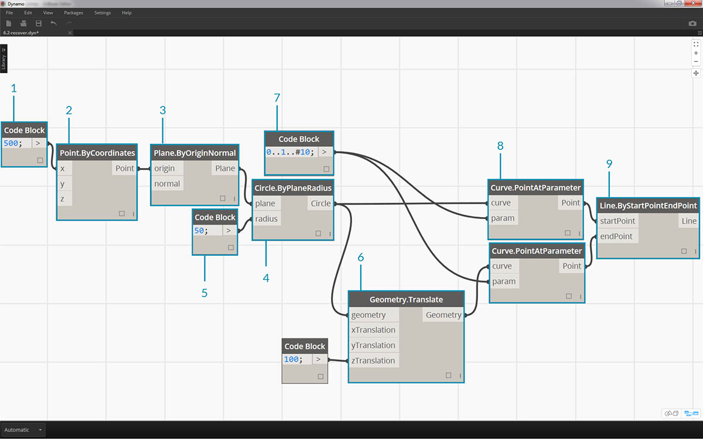
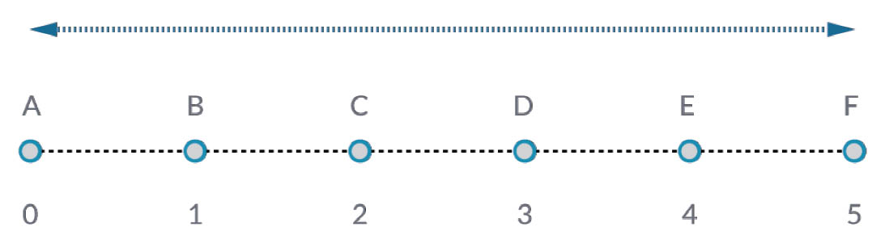
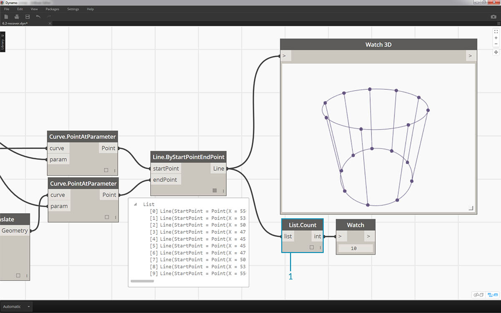
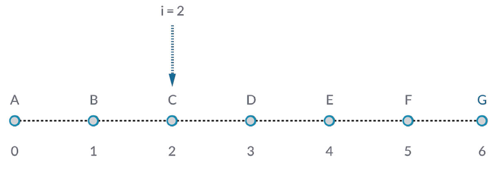
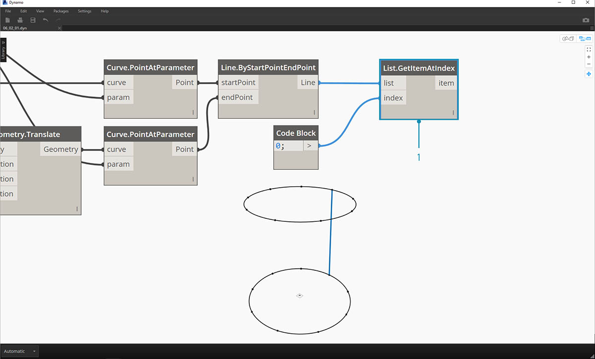
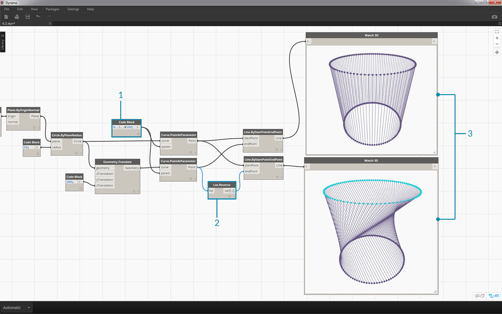
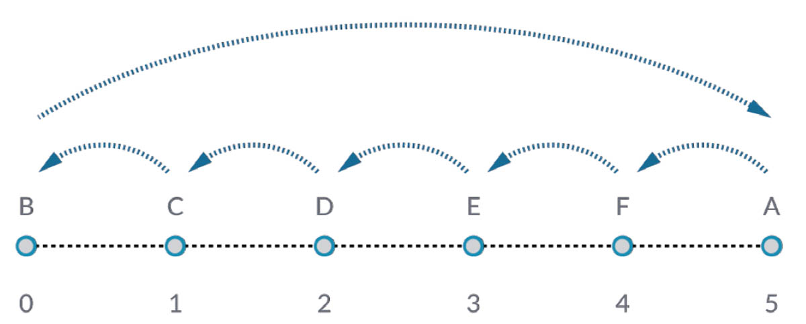

# Arbeiten mit Listen

### Arbeiten mit Listen

Im vorigen Kapitel wurde definiert, was unter einer Liste zu verstehen ist. Thema des folgenden Kapitels sind die Vorgänge, die für Listen durchgeführt werden können. Eine Liste lässt sich mit einem Stapel Spielkarten vergleichen. Der Stapel ist die Liste und jede Spielkarte steht für ein Element.

> Foto von [Christian Gidlöf](https://commons.wikimedia.org/wiki/File:Playing\_cards\_modified.jpg)

Welche **Abfragen** sind in der Liste möglich? Dies ermöglicht den Zugriff auf vorhandene Eigenschaften.

* Anzahl der Karten im Stapel? 52.
* Anzahl der Farben? 4.
* Material? Papier.
* Länge? 3.5" bzw. 89 mm.
* Breite? 2.5" bzw. 64 mm.

Welche **Aktionen** können für die Liste durchgeführt werden? Diese bewirken Änderungen in der Liste entsprechend der angegebenen Operation.

* Sie können den Stapel neu mischen.
* Sie können den Stapel nach Wert sortieren.
* Sie können den Stapel nach Farben sortieren.
* Sie können den Stapel teilen.
* Sie können den Stapel unterteilen, indem Sie die Karten an verschiedene Spieler ausgeben.
* Sie können eine bestimmte Karte im Stapel auswählen.

In Dynamo sind Blöcke vorhanden, die den oben genannten Vorgängen entsprechen und die Arbeit mit Listen von allgemeinen Daten ermöglichen. Die Lektionen weiter unten demonstrieren einige der grundlegenden Operationen, die für Listen durchgeführt werden können.

### Operationen für Listen

Das folgende Bild zeigt das Basisdiagramm, an dem grundlegende Operationen für Listen gezeigt werden. Dabei wird die Verwaltung von Daten in einer Liste betrachtet, und die visuellen Ergebnisse werden angezeigt.

**Übungslektion – Operationen für Listen**

> Laden Sie die zu dieser Übungslektion gehörige Beispieldatei herunter (durch Rechtsklicken und Wahl der Option Save Link As): [List-Operations.dyn](https://github.com/h-iL/ForkedDynamoPrimerReorganized/blob/de/06\_Designing-with-Lists/datasets/6-2/List-Operations.dyn). Eine vollständige Liste der Beispieldateien finden Sie im Anhang.

> 1. Beginnen Sie mit einem _Code Block_ mit dem Wert `500`.

1. Verbinden Sie ihn mit der _x_-Eingabe eines _Point.ByCoordinates_-Blocks.
2. Verbinden Sie den Block aus dem vorigen Schritt mit der origin-Eingabe eines _Plane.ByOriginNormal_-Blocks.
3. Verbinden Sie in einem _Circle.ByPlaneRadius_-Block den Block aus dem vorigen Schritt mit dem plane-Eingang.
4. Legen Sie mithilfe eines _Code Block_ den Wert `50;` als _Radius_ fest. Dadurch erstellen Sie den ersten Kreis.
5. Verschieben Sie mithilfe eines _Geometry.Translate_-Blocks den Kreis um 100 Einheiten nach oben in z-Richtung.
6. Definieren Sie mithilfe eines _Code Block_-Blocks einen Bereich von 10 Zahlen zwischen 0 und 1, wobei Sie die folgende Zeile verwenden: `0..1..#10;`.
7. Verbinden Sie den Codeblock aus dem vorigen Schritt mit der _param_-Eingabe zweier _Curve.PointAtParameter_-Blöcke. Verbinden Sie _Circle.ByPlaneRadius_ mit der curve-Eingabe des oberen Blocks und _Geometry.Translate_ mit der curve-Eingabe des Blocks darunter.
8. Verbinden Sie in einem _Line.ByStartPointEndPoint_ die beiden _Curve.PointAtParameter_-Blöcke.

> 1. Ein _Watch3D_-Block zeigt die Ergebnisse aus _Line.ByStartPointEndPoint_ an. Hier werden Linien zwischen zwei Kreisen gezeichnet, um einfache Listenoperationen darzustellen. Dieses Dynamo-Basisdiagramm wird zur Demonstration der unten genannten Listenoperationen verwendet.

#### List.Count

> Der Block _List.Count_ ist einfach: Er zählt die in einer Liste enthaltenen Werte und gibt ihre Anzahl zurück. Bei der Arbeit mit Listen von Listen gestaltet sich die Verwendung dieses Blocks differenzierter. Dies wird in weiter unten folgenden Abschnitten gezeigt.

**Übungslektion·– List.Count**

> Laden Sie die zu dieser Übungslektion gehörige Beispieldatei herunter (durch Rechtsklicken und Wahl der Option Save Link As): [List-Count.dyn](https://github.com/h-iL/ForkedDynamoPrimerReorganized/blob/de/06\_Designing-with-Lists/datasets/6-2/List-Count.dyn). Eine vollständige Liste der Beispieldateien finden Sie im Anhang.

> 1. Der _List.Count_-Block gibt die Anzahl der Linien aus dem _Line.ByStartPointEndPoint_-Block zurück. In diesem Fall beträgt dieser Wert 10. Dies stimmt mit der Anzahl der Punkte überein, die mithilfe des ursprünglichen _Code Block_-Blocks erstellt wurden.

#### List.GetItemAtIndex

> _List.GetItemAtIndex_ ist ein grundlegendes Verfahren zum Abrufen von Elementen in der Liste. In der Abbildung oben wird mithilfe des Indexwerts _"2"_ der Punkt mit der Bezeichnung \* "C"\* abgerufen.

**Übungslektion·– List.GetItemAtIndex**

> Laden Sie die zu dieser Übungslektion gehörige Beispieldatei herunter (durch Rechtsklicken und Wahl der Option Save Link As): [List-GetItemAtIndex.dyn](https://github.com/h-iL/ForkedDynamoPrimerReorganized/blob/de/06\_Designing-with-Lists/datasets/6-2/List-GetItemAtIndex.dyn). Eine vollständige Liste der Beispieldateien finden Sie im Anhang.

> 1. Mithilfe von _List.GetItemAtIndex_ wird der Index _"0"_ bzw. das erste Element in der Liste der Linien ausgewählt.

1. Der _Watch3D_-Block zeigt an, dass genau eine Linie ausgewählt wurde. Anmerkung: Um die Abbildung oben zu erhalten, müssen Sie die Vorschau von _Line.ByStartPointEndPoint_ deaktivieren.

#### List.Reverse

> _List.Reverse_ kehrt die Reihenfolge aller Elemente in der Liste um.

**Übungslektion – List.Reverse**

> Laden Sie die zu dieser Übungslektion gehörige Beispieldatei herunter (durch Rechtsklicken und Wahl der Option Save Link As): [List-Reverse.dyn](https://github.com/h-iL/ForkedDynamoPrimerReorganized/blob/de/06\_Designing-with-Lists/datasets/6-2/List-Reverse.dyn). Eine vollständige Liste der Beispieldateien finden Sie im Anhang.

> 1. Erstellen Sie für eine deutlichere Darstellung der Linienliste in umgekehrter Reihenfolge weitere Linien, indem Sie den Codeblock in `0..1..#100;` ändern.

1. Fügen Sie einen _List.Reverse_-Block zwischen _Curve.PointAtParameter_ und _Line.ByStartPointEndPoint_ für eine der beiden Punktlisten ein.
2. Die _Watch3D_-Blöcke zeigen zwei unterschiedliche Ergebnisse. Der erste zeigt das Ergebnis ohne umgekehrte Liste. Die Linien verlaufen vertikal und verbinden benachbarte Punkte. Die Umkehrung einer der Listen bewirkt jedoch, dass alle Punkte in entgegengesetzter Reihenfolge mit Punkten in der anderen Liste verbunden werden.

#### List.ShiftIndices

> _List.ShiftIndices_ ist ein geeignetes Werkzeug zum Erstellen verdrehter oder schraubenförmiger Muster oder für ähnliche Datenverarbeitungen. Dieser Block verschiebt die Elemente in einer Liste um die angegebene Anzahl von Indexpositionen.

**Übungslektion – List.ShiftIndices**

> Laden Sie die zu dieser Übungslektion gehörige Beispieldatei herunter (durch Rechtsklicken und Wahl der Option Save Link As): [List-ShiftIndices.dyn](https://github.com/h-iL/ForkedDynamoPrimerReorganized/blob/de/06\_Designing-with-Lists/datasets/6-2/List-ShiftIndices.dyn). Eine vollständige Liste der Beispieldateien finden Sie im Anhang.

.jpg>)

> 1. Fügen Sie auf dieselbe Weise wie beim Umkehren der Liste einen _List.ShiftIndices_-Block zwischen _Curve.PointAtParameter_ und _Line.ByStartPointEndPoint_ ein.

1. Verwenden Sie einen _Code Block_, dem Sie den Wert _"1"_ zuweisen, zum Verschieben der Liste um eine Indexposition.
2. Sie erhalten keine extreme Veränderung, aber sämtliche Linien im unteren _Watch3D_-Block wurden bei der Verbindung mit der anderen Punktgruppe um eine Indexposition versetzt.

.jpg>)

> 1. Wenn Sie im _Code Block_ einen größeren Wert, z. B. _"30"_ festlegen, ist ein deutlicher Unterschied in den diagonalen Linien zu erkennen. Die Verschiebung hat in diesem Fall dieselbe Wirkung wie die Irisblende einer Kamera und bewirkt eine Verdrehung der ursprünglichen Zylinderform.

#### List.FilterByBooleanMask

> _List.FilterByBooleanMask_ entfernt bestimmte Elemente anhand einer Liste boolescher Werte bzw. der Werte "true" oder "false".

**Übungslektion – List.FilterByBooleanMask**

> Laden Sie die zu dieser Übungslektion gehörige Beispieldatei herunter (durch Rechtsklicken und Wahl der Option Save Link As): [List-FilterByBooleanMask.dyn](https://github.com/h-iL/ForkedDynamoPrimerReorganized/blob/de/06\_Designing-with-Lists/datasets/6-2/List-FilterByBooleanMask.dyn). Eine vollständige Liste der Beispieldateien finden Sie im Anhang.

.jpg>)

> Um eine Liste mit true- und false-Werten zu erstellen, sind einige weitere Schritte erforderlich.

> 1. Definieren Sie mithilfe eines _Code Block_ einen Ausdruck mit der folgenden Syntax: `0..List.Count(list);`. Verbinden Sie den _Curve.PointAtParameter_-Block mit der _list_-Eingabe. Diese Einrichtung wird im Kapitel zu Codeblöcken genauer behandelt. In diesem Fall erhalten Sie mit dieser Codezeile eine Liste mit sämtlichen Indizes aus dem _Curve.PointAtParameter_-Block.

1. Fügen Sie einen Modulo-Block (_"%"_) ein und verbinden Sie die Ausgabe des _Code Block_ mit der _x_-Eingabe und den Wert _4_ mit der _y_-Eingabe. Dadurch erhalten Sie den Rest bei der Division der Indizes in der Liste durch 4. Die Modulo-Funktion ist sehr hilfreich beim Erstellen von Mustern. Alle Werte werden als mögliche Reste für 4 ausgegeben: 0, 1, 2, 3.
2. Aus dem _Modulo_-Block ergibt sich, dass Indizes mit dem Wert 0 durch 4 teilbar sind (0, 4, 8...). Mithilfe eines _"=="_-Blocks kann die Teilbarkeit durch Vergleich mit dem Wert _0_ geprüft werden.
3. Der _Watch_-Block zeigt genau dieses Ergebnis, d. h. das folgende true/false-Muster: _true,false,false,false..._.
4. Verbinden Sie die Ausgabe mit diesem true/false-Muster mit der mask-Eingabe zweier _List.FilterByBooleanMask_-Blöcke.
5. Verbinden Sie jeweils den _Curve.PointAtParameter_-Block mit der list-Eingaben des _List.FilterByBooleanMask_-Blocks.
6. Die Ausgaben von _Filter.ByBooleanMask_ lauten _"in"_ und _"out"_. _"In"_ steht für Werte mit dem Maskenwert _"true"_, _"out"_ für Werte mit dem Wert _"false"_. Indem Sie die _"in"_-Ausgaben mit den _startPoint_- und _endPoint_-Eingaben eines _Line.ByStartPointEndPoint_-Blocks verbinden, erhalten Sie eine gefilterte Liste von Linien.
7. Im _Watch3D_-Block ist zu erkennen, dass weniger Linien als Punkte vorhanden sind. Durch Filtern ausschließlich der true-Werte wurden lediglich 25 % der Punkte ausgewählt.
