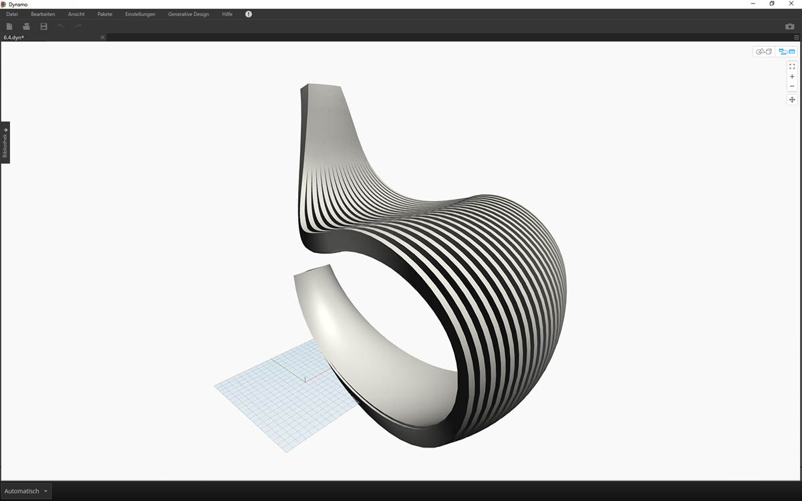

# n-dimensionale Listen

### n-dimensionale Listen

Sie können der Hierarchie weitere untergeordnete Ebenen hinzufügen. Datenstrukturen können Listen von Listen mit weit mehr als zwei Dimensionen umfassen. Da Listen in Dynamo als Objekte behandelt werden, können Sie Daten mit so vielen Dimensionen erstellen, wie es möglich ist.

Als Metapher für diese Funktionen eignen sich ineinander verschachtelte russische Matrjoschka-Puppen. Jede Liste kann ein Container betrachtet werden, der mehrere Elemente enthält. Jede Liste verfügt über eigene Eigenschaften und wird als eigenständiges Objekt angesehen.


> Die verschachtelten Matrjoschka-Puppen (Foto: [Zeta](https://www.flickr.com/photos/beppezizzi/145493363)) sind eine Metapher für n-dimensionale Listen. Jede Ebene steht für eine Liste und jede Liste enthält Elemente. In Dynamo kann jeder Container seinerseits mehrere Container enthalten (die den Elementen der jeweiligen Liste entsprechen).

Die visuelle Veranschaulichung n-dimensionaler Listen ist schwierig. In diesem Kapitel finden Sie jedoch eine Reihe von Übungslektionen für die Arbeit mit Listen, die mehr als zwei Dimensionen enthalten.

### Mapping und Kombinationen

Mapping ist der wohl komplexeste Aspekt der Datenverwaltung in Dynamo. Bei der Arbeit mit komplexen Listenhierarchien kommt ihm besondere Bedeutung zu. In den folgenden Übungslektionen wird gezeigt, wann Mapping und Kombinationen für mehrdimensionale Daten eingesetzt werden sollten.

Eine vorbereitende Einführung zu List.Map und List.Combine finden Sie im vorigen Abschnitt. In der letzten Übungslektion werden diese Blöcke für eine komplexe Datenstruktur angewendet.

#### Übungslektion: 2D-Listen – Grundlagen

> Laden Sie die zu dieser Übungslektion gehörigen Beispieldateien herunter (durch Rechtsklicken und Wahl der Option Save Link As). Eine vollständige Liste der Beispieldateien finden Sie im Anhang. 1.[n-Dimensional-Lists.dyn](https://github.com/h-iL/ForkedDynamoPrimerReorganized/blob/de/06\_Designing-with-Lists/datasets/6-4/n-Dimensional-Lists.dyn) 2.[n-Dimensional-Lists.sat](https://github.com/h-iL/ForkedDynamoPrimerReorganized/blob/de/06\_Designing-with-Lists/datasets/6-4/n-Dimensional-Lists.sat)

Dies ist die erste von drei Übungslektionen zur Strukturierung importierter Geometrie. In den Teilen dieser Übungsreihe werden nach und nach komplexere Datenstrukturen verwendet.

.jpg>)

> 1. Sie beginnen mit der SAT-Datei aus dem Ordner mit den Übungsdateien. Diese Datei können Sie mithilfe des _File Path_-Blocks abrufen.

1. Mit _Geometry.ImportFromSAT_ wird die Geometrie in Form zweier Oberflächen in die Dynamo-Vorschau importiert.

.jpg>)

> In dieser Übung wird der Einfachheit halber nur eine der Oberflächen verwendet.

> 1. Wählen Sie den Index _1_, um die obere Oberfläche auszuwählen. Verwenden Sie dazu den _List.GetItemAtIndex_-Block.

.jpg>)

> Im nächsten Schritt unterteilen Sie die Oberfläche mithilfe eines Rasters aus Punkten.

> 1. Fügen Sie in einem _Code Block_ die beiden folgenden Codezeilen ein:

```
0..1..#10;
0..1..#5;
```

1. Verbinden Sie in _Surface.PointAtParameter_ die beiden Codeblock-Werte mit _u_ und _v_. Ändern Sie die _Vergitterung_ dieses Knotens in _"Kreuzprodukt "_.
2. In der Ausgabe und in der Dynamo-Vorschau wird die Datenstruktur angezeigt.

.jpg>)

> 1. Um den Aufbau der Datenstruktur zu verdeutlichen, verbinden Sie einen _NurbsCurve.ByPoints_-Block mit der Ausgabe von _Surface.PointAtParameter_.

1. Sie erhalten zehn Kurven, die vertikal entlang der Oberfläche verlaufen.

.jpg>)

> 1. Mit einer einfachen _List.Transpose_-Operation vertauschen Sie die Spalten und Zeilen einer Liste von Listen.

1. Indem Sie die Ausgabe des _List.Transpose_-Blocks mit einem _NurbsCurve.ByPoints_-Blocks verbinden, erhalten Sie fünf Kurven, die horizontal auf der Oberfläche verlaufen.

#### Übungslektion: 2D-Listen – Weiterführend

In diesem Schritt erhöhen Sie die Komplexität. Angenommen, an den Kurven aus der vorigen Übungslektion soll eine Operation durchgeführt werden. Vielleicht sollen die Kurven auf eine andere Oberfläche bezogen und eine Erhebung zwischen ihnen erstellt werden. Die hierfür erforderliche Datenstruktur erfordert mehr Aufwand, wobei jedoch dieselbe Logik zugrunde liegt.

.jpg>)

> 1. Beginnen Sie mit demselben Schritt wie in der vorherigen Übung, indem Sie die obere der beiden Oberflächen der importierten Geometrie mithilfe des _List.GetItemAtIndex_-Blocks isolieren.

.jpg>)

> 1. Versetzen Sie die Oberfläche mithilfe von _Surface.Offset_ um den Wert _10_.

.jpg>)

> 1. Definieren Sie auf dieselbe Weise wie in der vorigen Übung einen _Code Block_ mit den folgenden beiden Codezeilen:

```
0..1..#10;
0..1..#5;
```

1. Verbinden Sie diese Ausgaben mit zwei _Surface.PointAtParameter_-Blöcken, jeweils mit der _Vergitterung_ _"Kreuzprodukt"_. Verbinden Sie einen dieser Blöcke mit der ursprünglichen und den anderen mit der versetzten Oberfläche.

.jpg>)

> 1. Verbinden Sie wie in der vorigen Übungslektion die Ausgaben mit zwei _NurbsCurve.ByPoints_-Blöcken.

1. Die Dynamo-Vorschau zeigt zwei Kurvengruppen für die beiden Oberflächen.

.jpg>)

> 1. Mithilfe von _List.Create_ können Sie die beiden Kurvengruppen in einer Liste von Listen kombinieren.

1. Die Ausgabe zeigt zwei Listen mit je zehn Elementen für die beiden Gruppen verbundener Nurbs-Kurven.
2. Mithilfe von _Surface.ByLoft_ können Sie diese Datenstruktur visuell verdeutlichen. Mithilfe dieses Blocks verbinden Sie sämtliche Kurven in jeder der beiden Unterlisten durch eine Erhebung.

.jpg>)

> 1. Mithilfe von _List.Transpose_ werden die Spalten und Zeilen vertauscht. Dadurch werden zwei Listen mit je zehn Kurven in zehn Listen mit je zwei Kurven umgewandelt. Damit haben Sie für jede Nurbs-Kurve eine Beziehung zu ihrer Nachbarkurve auf der anderen Oberfläche erstellt.

1. Mit _Surface.ByLoft_ erhalten Sie eine gerippte Struktur.

.jpg>)

> 1. Als Alternative zu _List.Transpose_ können Sie _List.Combine_ verwenden. Damit wird ein _"Kombinator"_ für die beiden Unterlisten ausgeführt.

1. In diesem Fall wird _List.Create_ als _"Kombinator"_ verwendet, um eine Liste der Elemente innerhalb der Unterlisten zu erstellen.
2. Mithilfe des _Surface.ByLoft_-Blocks erhalten Sie dieselben Oberflächen wie im vorigen Schritt. Transpose ist in diesem Falle einfacher zu verwenden, bei komplexeren Datenstrukturen erweist sich _List.Combine_ jedoch als zuverlässiger.

.jpg>)

> 1. Sie können in einem der vorigen Schritte die Richtung der Kurven in der gerippten Struktur ändern, indem Sie List.Transpose vor der Verbindung zu _NurbsCurve.ByPoints_ einfügen. Dadurch werden Spalten und Zeilen vertauscht und Sie erhalten 5 horizontale Rippen.

#### Übungslektion: 3D-Listen

In diesem Abschnitt gehen Sie einen Schritt weiter. Sie arbeiten in dieser Übungslektion mit beiden importierten Oberflächen und erstellen eine komplexe Datenhierarchie. Dabei soll dieselbe Operation nach wie vor unter Verwendung derselben zugrunde liegenden Logik durchgeführt werden.

.jpg>)

> 1. Beginnen Sie mit der Datei aus der vorherigen Übungslektion.

.jpg>)

> 1. Verwenden Sie wie in der vorigen Übungslektion den _Surface.Offset_-Block, um einen Versatz mit dem Wert _10_ zu erstellen.

1. Die Ausgabe zeigt, dass Sie mithilfe des Versatzblocks zwei Oberflächen erstellt haben.

.jpg>)

> 1. Definieren Sie auf dieselbe Weise wie in der vorigen Übungslektion einen Codeblock mit den folgenden beiden Codezeilen:

```
0..1..#20;
0..1..#10;
```

1. Verbinden Sie diese Ausgaben mit zwei _Surface.PointAtParameter_-Blöcken, jeweils mit der Vergitterung _"Kreuzprodukt"_. Verbinden Sie einen dieser Blöcke mit den ursprünglichen und den anderen mit den versetzten Oberflächen.

.jpg>)

> 1. Verbinden Sie wie in der vorigen Übungslektion die Ausgaben mit zwei _NurbsCurve.ByPoints_-Blöcken.

1. Die Ausgabe der _NurbsCurve.ByPoints_-Blöcke ist eine Liste aus zwei Listen mit komplexerer Struktur als bei denjenigen in der vorigen Übungslektion. Die Daten werden durch die zugrunde liegende Oberfläche kategorisiert: Damit haben Sie der Datenstruktur eine weitere Ebene hinzugefügt.
2. Im _Surface.PointAtParameter_-Block ist eine komplexere Struktur zu erkennen: Sie haben eine Liste aus Listen von Listen erstellt.

.jpg>)

> 1. Führen Sie mithilfe des _List.Create_-Blocks die Nurbs-Kurven zu ein und derselben Datenstruktur zusammen, wobei eine Liste aus Listen von Listen entsteht.

1. Durch Verbinden eines _Surface.ByLoft_-Blocks erhalten Sie eine Version der ursprünglichen Oberflächen, die in ihrer eigenen Liste wie aus der ursprünglichen Datenstruktur erstellt erhalten bleiben.

.jpg>)

> 1. In der vorigen Übung konnten Sie mithilfe von _List.Transpose_ eine gerippte Struktur erstellen. Dies ist hier nicht möglich. Die Funktion Transpose ist für zweidimensionale Listen vorgesehen. Hier liegt eine dreidimensionale Liste vor, die ein "Vertauschen von Spalten und Zeilen" nicht ohne Weiteres zulässt. Da Listen Objekte sind, können mit _List.Transpose_ zwar die Listen mit den Unterlisten vertauscht werden, die Nurbs-Kurven, die sich eine Ebene tiefer in der Hierarchie befinden, bleiben dabei jedoch unverändert.

.jpg>)

> 1. In diesem Fall ist _List.Combine_ besser geeignet. Für komplexere Datenstrukturen sollten _List.Map_- und _List.Combine_-Blöcke zum Einsatz kommen.

1. Mit \*List.Create \* als _"Kombinator"_ erhalten Sie eine Datenstruktur, die in diesem Fall besser verwendbar ist.

.jpg>)

> 1. Die Datenstruktur muss auf der nächsttieferen Ebene der Hierarchie nach wie vor vertauscht werden. Verwenden Sie hierfür _List.Map_. Dies funktioniert auf dieselbe Weise wie _List.Combine_, wobei jedoch nur eine Liste anstelle mehrerer eingegeben wird.

1. Als Funktion für _List.Map_ wird _List.Transpose_ eingegeben, wodurch die Spalten und Zeilen der Unterlisten innerhalb der Hauptliste vertauscht werden.

.jpg>)

> 1. Schließlich können Sie die Nurbs-Kurven in der vorgesehenen Datenhierarchie durch eine Erhebung miteinander verbinden und erhalten eine gerippte Struktur.

.jpg>)

> 1. Fügen Sie der Geometrie mithilfe eines _Surface.Thicken_-Blocks Tiefe hinzu.

.jpg>)

> 1. Eine Deckschicht an der Rückseite dieser Struktur scheint passend. Wählen Sie daher mithilfe von _List.GetItemAtIndex_ die hintere der beiden durch die Erhebung verbundenen Oberflächen aus den vorigen Schritten aus.

.jpg>)

> 1. Mit der Verstärkung dieser ausgewählten Oberflächen ist die Untergliederung vollständig.



> Das Ergebnis ist vielleicht kein sonderlich bequemer Schaukelstuhl, aber er enthält erhebliche Datenmengen.

.jpg>)

> Im letzten Schritt kehren Sie die Richtung der Rippen um. Bei diesem Vorgang wird in ähnlicher Weise wie in der vorigen Übungslektion die Funktion Transpose verwendet.

> 1. Da in der Hierarchie eine weitere Ebene vorhanden ist, müssen Sie _List.Map_ zusammen mit _List.Transpose_ als Funktion verwenden, um die Richtung der Nurbs-Kurven zu ändern.

.jpg>)

> 1. Es ist eventuell sinnvoll, die Anzahl der Rippen zu erhöhen. Ändern Sie daher den Codeblock wie folgt:

```
0..1..#20;
0..1..#10;
```

.jpg>)

> Während die erste Version des Schaukelstuhls eher elegant wirkte, punktet das zweite Modell durch robuste, sportliche Qualitäten.
