# Kurzschreibweisen

table{box-shadow: 2px 2px 2px #BBBBBB;max-width:75%;display:block;margin-left: auto; margin-right: auto } img{display:block;margin-left: auto; margin-right: auto }

### Kurzschreibweisen

Für Codeblöcke stehen einige einfache Kurzschreibweisen zur Verfügung, die, einfach ausgedrückt, die Arbeit mit den Daten _erheblich_ erleichtern. Im Folgenden werden die Grundlagen genauer erläutert und beschrieben, wie die jeweilige Kurzschreibweise zum Erstellen und Abfragen von Daten verwendet werden kann.

| **Datentyp**                     | **Dynamo-Standarddarstellung**       | **Codeblock-Entsprechung**             |
| -------------------------------- | ------------------------------------ | -------------------------------------- |
| Zahlen                           | 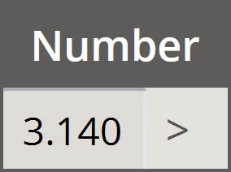   | 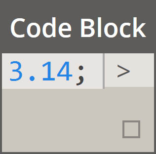   |
| Zeichenfolgen                    | 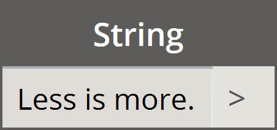   | 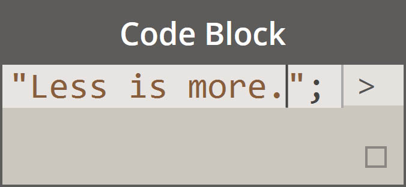   |
| Sequenzen                        | 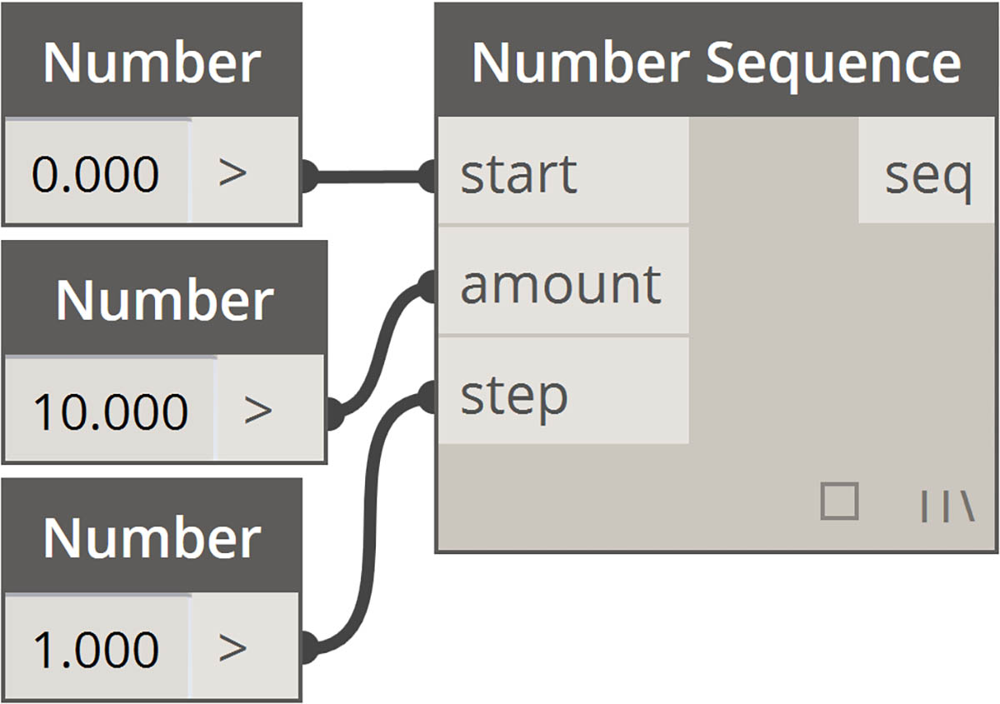 | 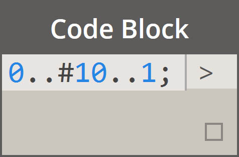 |
| Bereiche                         | 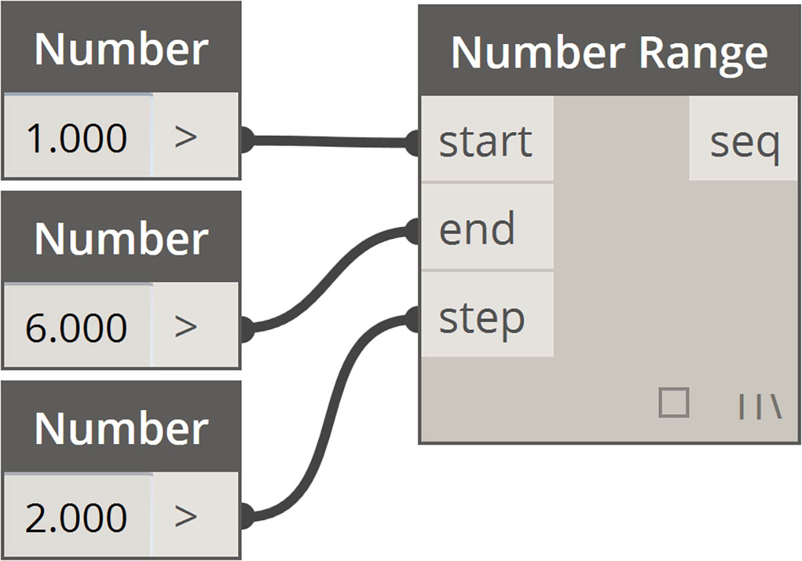    |     |
| Eintrag an Indexposition abrufen | 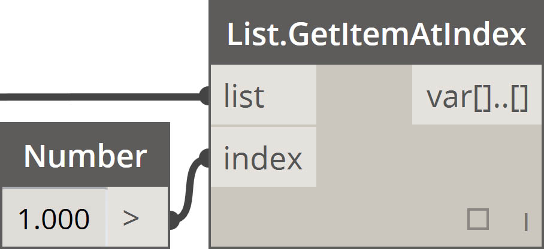  |   |
| Liste erstellen                  | 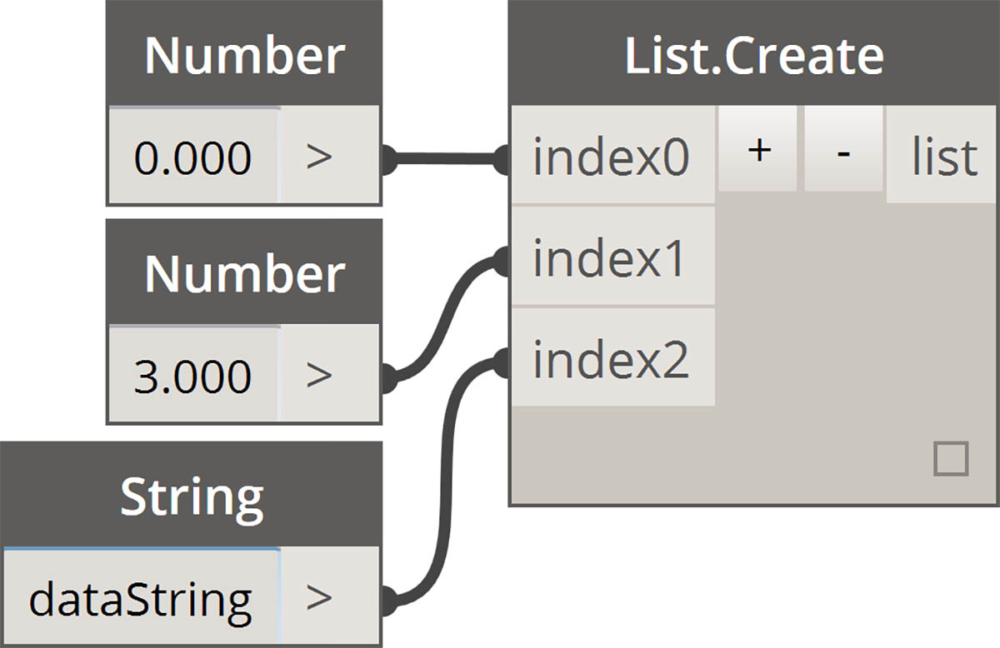     | 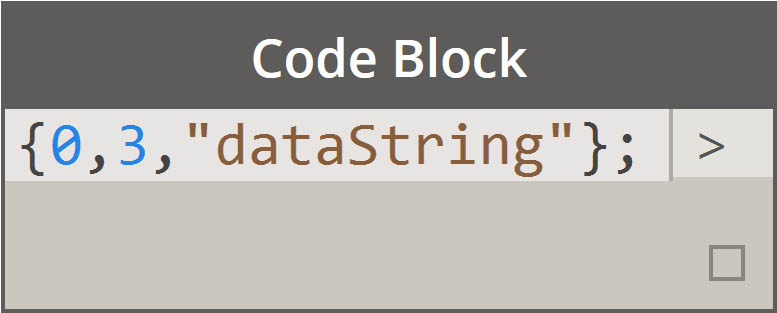     |
| Zeichenfolgen verketten          | 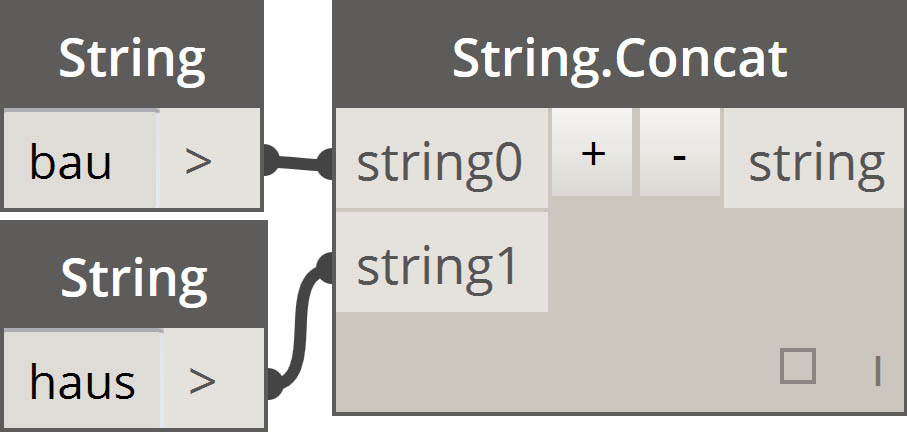   | 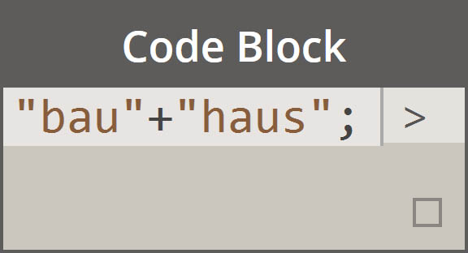   |
| Bedingungsanweisungen            | 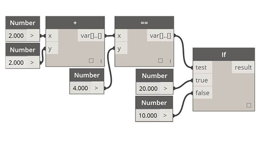       | 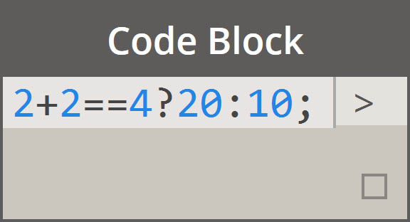       |

#### Zusätzliche Syntax

| Block/Blöcke                               | Codeblock-Entsprechung | Anmerkung                                                                                                                             |
| ------------------------------------------ | ---------------------- | ------------------------------------------------------------------------------------------------------------------------------------- |
| Beliebiger Operator (+, &&, >=, Not, usw.) | +, &&, >=, !, usw.     | Beachten Sie, dass "Not" (Nicht) durch "!" ersetzt wird, der Block jedoch zur Unterscheidung von "Fakultät" nach wie vor "Not" heißt. |
| Boolescher Wert True                       | true;                  | Anmerkung: Kleinbuchstaben                                                                                                            |
| Boolescher Wert False                      | false;                 | Anmerkung: Kleinbuchstaben                                                                                                            |

#### Bereiche

Die Methoden zum Definieren von Bereichen und Sequenzen können in einfachen Kurzschreibweisen ausgedrückt werden. Die folgende Abbildung bietet eine Anleitung zum Definieren einer Liste mit numerischen Daten mithilfe der Syntax ".." in Codeblöcken. Nachdem Sie sich mit dieser Notation vertraut gemacht haben, können Sie numerische Daten äußerst effizient erstellen: 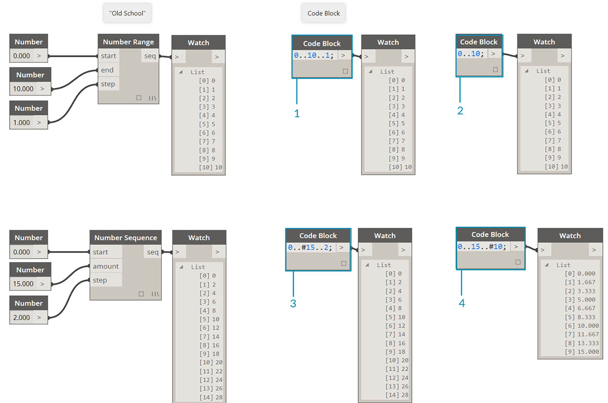

> 1. In diesem Beispiel wird ein Zahlenbereich durch einfache Codeblock-Syntax mit Angaben für `Start..Ende..Schrittgröße;` ersetzt. In numerischer Darstellung erhalten Sie die Werte `0..10..1;`

1. Beachten Sie, dass die Syntax `0..10..1;` der Syntax `0..10;` entspricht. Der Wert 1 wird in der Kurzschreibweise für die Schrittgröße vorgegeben. Mit `0..10;` erhalten Sie daher eine Folge von 0 bis 10 mit der Schrittgröße 1.
2. Das Beispiel für die _Zahlenfolge_ ist ähnlich, allerdings wird hier mithilfe eines _#_-Zeichens angegeben, dass die Liste nicht beim Wert 15 enden, sondern 15 Werte enthalten soll. In diesem Fall definieren Sie: `Anfang..Anzahl Schritte..Schrittgröße:`. Die Syntax für die Folge lautet `0..#15..2`.
3. Platzieren Sie das _#_-Zeichen aus dem vorigen Schritt jetzt im Bereich für die _Schrittgröße_ der Syntax. Damit haben Sie einen _Zahlenbereich_ vom _Anfang_ zum _Ende_ erstellt. Die Notation für die _Schrittgröße_ verteilt die angegebene Anzahl Werte gleichmäßig zwischen diesen Angaben: `Anfang..Ende..Anzahl Schritte`.

#### Erweiterte Bereiche

Indem Sie erweiterte Bereiche erstellen, können Sie auf einfache Weise mit Listen von Listen arbeiten. In den Beispielen unten wird eine Variable aus der Darstellung der primären Liste isoliert und ein weiterer Bereich aus dieser Liste erstellt. .jpg>)

> 1. Vergleichen Sie die Notation mit und ohne _#_-Zeichen bei der Erstellung verschachtelter Bereiche. Dabei gilt dieselbe Logik wie bei einfachen Bereichen, die Angaben sind jedoch etwas komplexer.

1. Sie können an beliebiger Stelle des primären Bereichs einen Unterbereich erstellen. Es ist auch möglich, zwei Unterbereiche zu verwenden.
2. Mithilfe des Werts für _end_ in einem Bereich erstellen Sie weitere Bereiche unterschiedlicher Länge.

.jpg>)

> Vergleichen Sie als Übung zu dieser Logik die beiden oben gezeigten Kurzschreibweisen und testen Sie, wie _Unterbereiche_ und das _#_-Zeichen sich auf das Ergebnis auswirken.

#### Erstellen von Listen und Abrufen von Einträgen aus Listen

Sie können Listen nicht nur mithilfe von Kurzschreibweisen, sondern auch ad hoc erstellen. Solche Listen können eine Vielfalt von Elementtypen enthalten und können abgefragt werden (da Listen ihrerseits Objekte sind). Kurz zusammengefasst: In einem Codeblock verwenden Sie zum Erstellen von Listen geschweifte und zum Abfragen der Listen eckige Klammern.

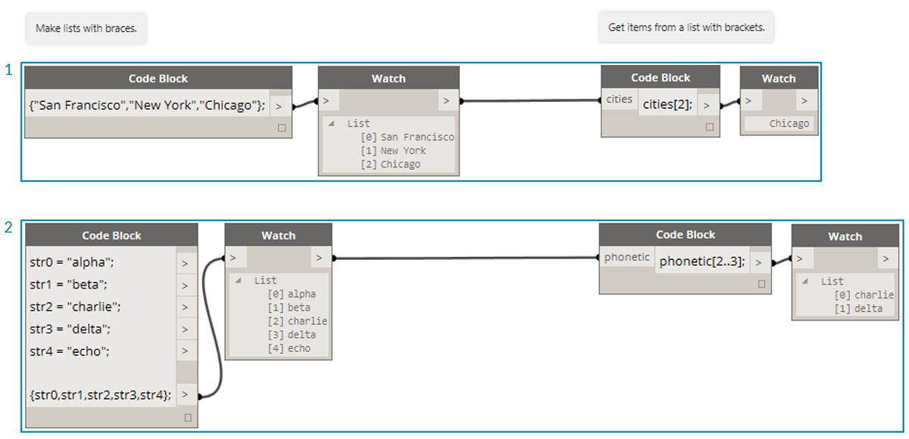

> 1. Sie können Listen schnell aus Zeichenfolgen erstellen und über die Indizes der Einträge abfragen.

1. Sie können Listen mit Variablen erstellen und sie über die Kurzschreibweisen für Bereiche abfragen.

Verschachtelte Listen werden auf ähnliche Weise verwaltet. Beachten Sie dabei die Reihenfolge der Listen und verwenden Sie mehrere Paare eckiger Klammern:

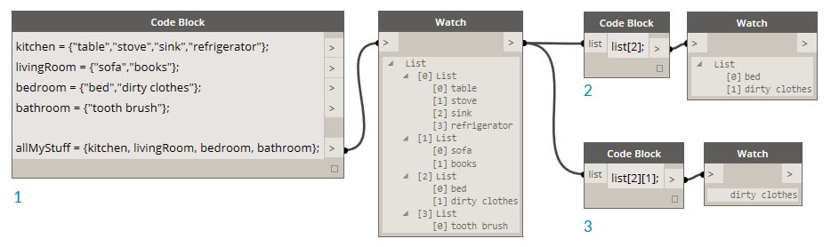

> 1. Definieren Sie eine Liste von Listen.

1. Fragen Sie eine Liste mit einer Angabe in eckigen Klammern ab.
2. Fragen Sie einen Eintrag mit zwei Angaben in eckigen Klammern ab.

#### Übungslektion

> Laden Sie die zu dieser Übungslektion gehörige Beispieldatei herunter (durch Rechtsklicken und Wahl der Option "Save Link As..."). Eine vollständige Liste der Beispieldateien finden Sie im Anhang. [Obsolete-Nodes\_Sine-Surface.dyn](https://github.com/h-iL/ForkedDynamoPrimerReorganized/blob/de/07\_Code-Block/datasets/7-3/Obsolete-Nodes\_Sine-Surface.dyn)

In dieser Übung wenden Sie Ihre Kenntnisse der Kurzschreibweise an und erstellen eine originelle gewölbte Oberfläche, die Sie mithilfe von Bereichen und Formeln definieren. Beachten Sie in dieser Übung, wie Codeblöcke und bestehende Dynamo-Blöcke zusammenwirken: Für umfangreiche Datenverarbeitungen kommen Codeblöcke zum Einsatz, durch die visuelle Darstellung der Dynamo-Blöcke ist die Definition leichter zu lesen.

.jpg>)

> Erstellen Sie zunächst eine Oberfläche, indem Sie die oben gezeigten Blöcke verbinden. Verwenden Sie zum Definieren der Breite und Länge keinen Number-Block, sondern doppelklicken Sie in den Ansichtsbereich und geben Sie den Wert `100;` in einen Codeblock ein.

.jpg>)

> 1. Definieren Sie einen Bereich zwischen 0 und 1 mit 50 Unterteilungen, indem Sie `0..1..#50` in einen Codeblock eingeben.

1. Verbinden Sie den Bereich mit _Surface.PointAtParameter_. Dieser Block benötigt _u_- und _v_-Werte zwischen 0 und 1 für die gesamte Oberfläche. Sie müssen die _Vergitterung_ in _Kartesisches Produkt_ ändern. Klicken Sie dazu mit der rechten Maustaste auf den _Surface.PointAtParameter_-Block.

.jpg>)

> In diesem Schritt verschieben Sie das Raster aus Punkten mithilfe der ersten Funktion in z-Richtung nach oben. Dieses Raster steuert die zu erstellende Oberfläche anhand der zugrunde liegenden Funktion.

> 1. Fügen Sie die visuellen Blöcke wie in der Abbildung oben gezeigt in den Ansichtsbereich ein.

1. Verwenden Sie anstelle eines Formelblocks einen Codeblock mit der folgenden Zeile: `(0..Math.Sin(x*360)..#50)*5;`. Dadurch definieren Sie, kurz zusammengefasst, einen Bereich, der eine Formel enthält. Diese Formel ist die Sinusfunktion. Da für die Sinusfunktion in Dynamo Werte in Grad eingegeben werden müssen, multiplizieren Sie die _x_-Werte (d. h. den eingegebenen Bereich zwischen 0 und 1) mit _360_, um eine vollständige Sinuskurve zu erhalten. Als Nächstes wird dieselbe Anzahl Unterteilungen als Rastersteuerpunkte für die einzelnen Reihen benötigt. Definieren Sie daher 50 Unterteilungen mit _#50_. Der Multiplikator 5 schließlich verstärkt die Verschiebung, sodass deren Wirkung in der Dynamo-Vorschau deutlich zu sehen ist.

.jpg>)

> 1. Der bis hierher verwendete Codeblock erfüllte seine Funktion, war jedoch nicht vollständig parametrisch. Seine Parameter sollen dynamisch gesteuert werden. Ersetzen Sie daher die Zeile aus dem vorigen Schritt durch `(0..Math.Sin(x*360*cycles)..#List.Count(x))*amp;`. Dadurch erhalten Sie die Möglichkeit, diese Werte anhand Ihrer Eingaben zu definieren.

.jpg>)

> 1. Indem Sie die Werte der Schieberegler (zwischen 0 und 10) ändern, erhalten Sie interessante Ergebnisse.

.jpg>)

> 1. Indem Sie Transpose auf den Zahlenbereich anwenden, kehren Sie die Richtung der Wellen um: `transposeList = List.Transpose(sineList);`

.jpg>)

> 1. Durch Addieren von sineList und tranposeList erhalten Sie eine verzerrte Hülle: `eggShellList = sineList+transposeList;`

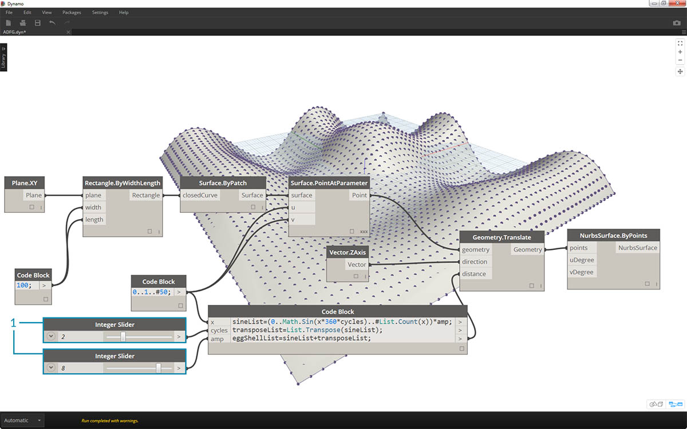

> 1. Ändern Sie die Werte in den Schiebereglern erneut, um ein ruhigeres Muster zu erhalten.

.jpg>)

> 1. In dieser letzten Übung fragen Sie isolierte Teile der Daten mithilfe eines Codeblocks ab. Fügen Sie den oben gezeigten Codeblock zwischen dem _Geometry.Translate_- und dem _NurbsSurface.ByPoints_-Block ein, um die Oberfläche aus einem bestimmten Bereich von Punkten neu zu erstellen. Der Codeblock enthält die folgende Textzeile: `sineStrips[0..15..1];`. Dadurch werden die ersten 16 (von 50) Punktreihen ausgewählt. Wenn die Oberfläche neu erstellt wird, ist zu erkennen, dass ein isolierter Teil des Punktrasters generiert wurde.

.jpg>)

> 1. Im letzten Schritt erweitern Sie den Codeblock um parametrische Funktionen, indem Sie einen Schieberegler mit dem Bereich von 0 bis 1 zur Steuerung der Abfrage verwenden. Verwenden Sie hierfür die folgende Codezeile: `sineStrips[0..((List.Count(sineStrips)-1)*u)];`. Dies mag etwas verwirrend wirken. Diese Codezeile ermöglicht jedoch eine schnelle Skalierung der Länge der Liste über einen Multiplikator zwischen 0 und 1.

.jpg>)

> 1. Mithilfe des Werts _.53_ im Schieberegler erstellen Sie eine Oberfläche, die sich knapp über die Mitte des Rasters hinaus erstreckt.

.jpg>)

> 1. Mit dem Wert _1_ im Schieberegler wird erwartungsgemäß eine Oberfläche aus dem gesamten Punktraster erstellt.

.jpg>)

> Im resultierenden visuellen Diagramm können Sie die einzelnen Codeblöcke markieren und ihre Funktionen sehen.

> 1. Der erste Codeblock ersetzt den _Number_-Block.

1. Der zweite Codeblock ersetzt den _Number Range_-Block.
2. Der dritte Codeblock ersetzt den _Formula_-Block (sowie _List.Transpose_, _List.Count_ und _Number Range_).
3. Der vierte Codeblock ruft eine Liste von Listen ab und ersetzt den _List.GetItemAtIndex_-Block.
