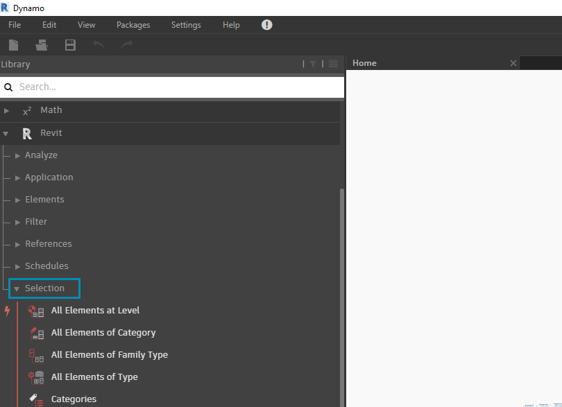
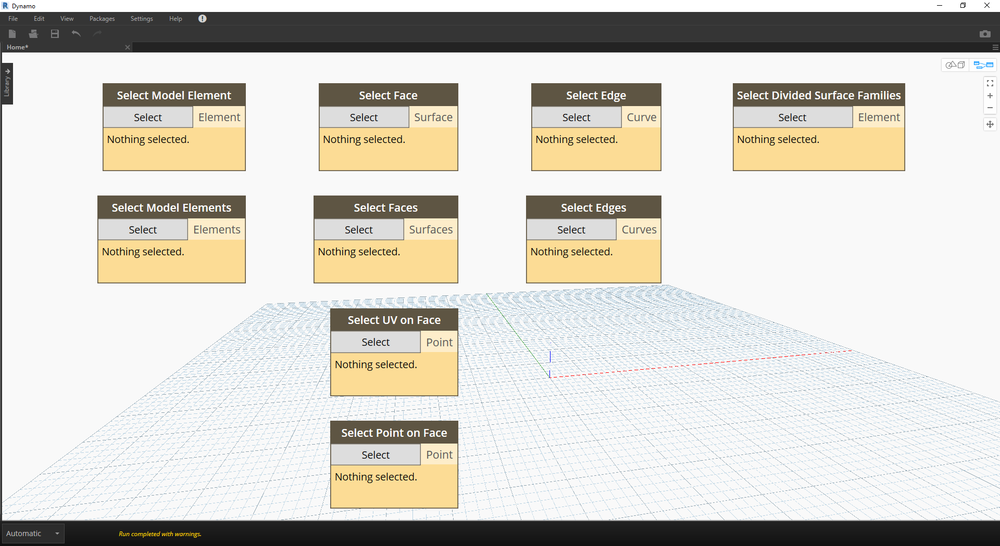
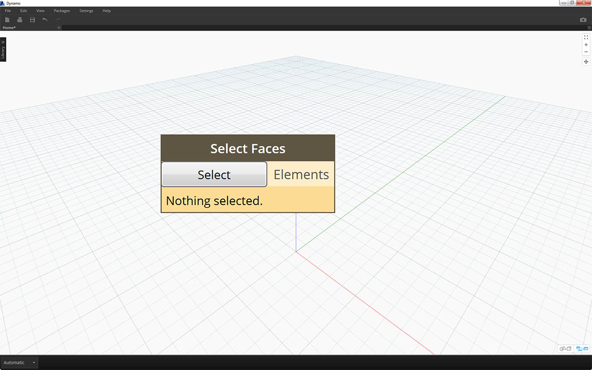

# Auswählen

Revit ist eine datenintensive Umgebung. Dadurch steht ein ganzes Spektrum von Auswahlfunktionen über das gewohnte "Zeigen und Klicken" hinaus zur Verfügung. Es ist möglich, während der Durchführung parametrischer Vorgänge die Revit-Datenbank abzufragen und Revit-Elemente dynamisch mit Dynamo-Geometrie zu verknüpfen.

> Die in der Benutzeroberfläche enthaltene Revit-Bibliothek enthält die Kategorie "Selection" mit mehreren Möglichkeiten zur Auswahl von Geometrie.

Damit Sie Revit-Elemente Ihren Zwecken entsprechend auswählen können, müssen Sie die Elementhierarchie in Revit kennen. Sollen alle Wände in einem Projekt ausgewählt werden? Wählen Sie sie nach Kategorie aus. Möchten Sie alle Eames-Stühle in Ihrer Diele im Stil der Jahrhundertmitte auswählen? In diesem Fall wählen Sie sie nach Familie aus. Machen Sie sich kurz mit der Revit-Hierarchie vertraut, bevor Sie mit einer Übung beginnen.

### Revit-Hierarchie

Dies lässt sich mit der Taxonomie in der Biologie vergleichen: Reich, Stamm, Klasse, Ordnung, Familie, Gattung, Art. Die Elemente in Revit sind auf ähnliche Weise geordnet. Die Revit-Hierarchie gliedert sich grundsätzlich in Kategorien, Familien, Typen\* und Exemplare. Ein Exemplar ist ein einzelnes Modellelement (mit eindeutiger ID), während eine Kategorie eine allgemeine Gruppe definiert (z. B. Wände oder Geschossdecken). Diese Struktur der Revit-Datenbank ermöglicht es, ein Element und anhand der angegebenen Ebene in der Hierarchie auch alle ihm ähnlichen Elemente auszuwählen.

\*_Hinweis: Typen sind in Revit auf andere Weise definiert als in der Programmierung. In Revit ist mit einem Typ ein Zweig in der Hierarchie, nicht ein "Datentyp" gemeint._

### Datenbanknavigation mit Dynamo-Blöcken

Die drei Abbildungen unten zeigen die wichtigsten Kategorien für die Auswahl von Revit-Elementen in Dynamo im Detail. Sie lassen sich hervorragend miteinander kombinieren, was in den weiter unten folgenden Übungen genauer beschrieben wird.

> _Zeigen und Klicken_: Dies ist das einfachste Verfahren zur direkten Auswahl von Revit-Elementen. Sie können dabei ein vollständiges Modellelement oder nur Teile seiner Topologie (z. B. eine Fläche oder Kante) auswählen. Diese bleiben dynamisch mit dem Revit-Objekt verknüpft, d. h., wenn in der Revit-Datei die Position oder Parameter geändert werden, wird das referenzierte Dynamo-Element im Diagramm aktualisiert.

> _Dropdown-Menüs_: In diesen Menüs wird eine Liste aller Elemente im Revit-Projekt erstellt, auf die Sie zugreifen können. Über diese können Sie Revit-Elemente referenzieren, die eventuell in der jeweiligen Ansicht nicht sichtbar sind. Dieses Werkzeug eignet sich hervorragend zum Abfragen bestehender und zum Erstellen neuer Elemente in einem Revit-Projekt oder im Familieneditor.

> Sie können darüber hinaus Revit-Elemente anhand ihrer Ebene in der _Revit-Hierarchie_ auswählen. Diese Option erweist sich als hocheffizient, wenn große Datenmengen zur Vorbereitung der Dokumentation oder für die generative Instanziierung und Anpassung verarbeitet werden müssen.

Die drei oben stehenden Abbildungen bilden die Grundlage für die folgende Übung, in der Sie Elemente in einem einfachen Revit-Projekt auswählen. Dies dient als Vorbereitung für die parametrischen Anwendungen, die Sie in den übrigen Abschnitten dieses Kapitels erstellen.

## Übung

> Laden Sie die zu dieser Übungslektion gehörigen Beispieldateien herunter (durch Rechtsklicken und Wahl der Option "Save Link As"). Eine vollständige Liste der Beispieldateien finden Sie im Anhang.

> 1. [Selecting.dyn](https://github.com/h-iL/ForkedDynamoPrimerReorganized/blob/de/08\_Dynamo-for-Revit/datasets/8-2/Selecting.dyn)

1. [ARCH-Selecting-BaseFile.rvt](https://github.com/h-iL/ForkedDynamoPrimerReorganized/blob/de/08\_Dynamo-for-Revit/datasets/8-2/ARCH-Selecting-BaseFile.rvt)

.png>)

> Diese Revit-Beispieldatei enthält drei Elementtypen eines einfachen Gebäudes. Diese dient als Beispiel für die Auswahl von Revit-Elementen innerhalb der Revit-Hierarchie.

> 1. Gebäudekörper

1. Fachwerk (adaptive Bauteile)
2. Träger (Tragwerkselemente)

> Welche Schlussfolgerungen erlauben die momentan in der Revit-Projektansicht angezeigten Elemente? Welche Ebene in der Hierarchie wird zur Auswahl der gewünschten Elemente benötigt? Bei der Arbeit in umfangreichen Projekten gestalten sich diese Fragen selbstverständlich komplexer. Es stehen zahlreiche Optionen zur Verfügung: Sie können Elemente nach Kategorien, Ebenen, Familien, Exemplaren usw. auswählen.

> 1. In diesem Fall liegt eine einfache Struktur vor. Wählen Sie daher den Gebäudekörper, indem Sie im Menüblock Categories die Option _Mass_ wählen. Sie finden dies über Revit > Selection.

1. Die Ausgabe der Kategorie Mass ist die Kategorie selbst. Es müssen jedoch Elemente auswählen. Verwenden Sie hierfür den Block _All Elements of Category_.

Bis jetzt wird noch keine Geometrie in Dynamo angezeigt. Sie haben ein Revit-Element ausgewählt, dieses jedoch noch nicht in Dynamo-Geometrie konvertiert. Diese Unterscheidung ist wichtig. Angenommen, Sie wählen eine große Zahl von Elementen aus. In diesem Fall wäre es nicht sinnvoll, alle diese Elemente in der Vorschau in Dynamo anzuzeigen, da dies die Leistung beeinträchtigen würde. Dynamo ist ein Werkzeug zur Verwaltung von Revit-Projekten, ohne dass notwendigerweise Geometrie verarbeitet wird. Dies wird im nächsten Abschnitt dieses Kapitels näher betrachtet.

In diesem Fall arbeiten Sie jedoch mit einfacher Geometrie, die in der Dynamo-Vorschau angezeigt werden kann. Neben dem Eintrag "BldgMass" im oben gezeigten Watch-Block steht eine grün unterlegte Nummer\*. Dies ist die ID des Elements. Sie weist außerdem darauf hin, dass wir es mit einem Revit-Element zu tun haben, und nicht mit Dynamo-Geometrie. Im nächsten Schritt konvertieren Sie dieses Revit-Element in Dynamo-Geometrie.

.png>)

> 1. Durch Verwenden des Blocks _Element. Faces_ erhalten Sie eine Liste von Oberflächen, die die einzelnen Flächen des Revit-Körpers repräsentieren. Die Geometrie wird jetzt im Dynamo-Ansichtsfenster angezeigt und Sie können damit beginnen, Flächen für parametrische Operationen zu referenzieren.

.jpg>)

> Eine Alternative dazu wird im Folgenden beschrieben. In diesem Fall nehmen Sie die Auswahl nicht über die Revit-Hierarchie _(All Elements of Category)_ vor, sondern wählen Geometrie explizit in Revit aus.

> 1. Klicken Sie im Block _Select Model Element_ auf die Schaltfläche _select_ (bzw. _change_). Wählen Sie im Revit-Ansichtsfenster das gewünschte Element aus. In diesem Fall ist dies der Gebäudekörper.

1. Anstelle von _Element.Faces_ können Sie mithilfe von _Element.Geometry_ den gesamten Körper als Volumengeometrie auswählen. Dadurch wird die gesamte in diesem Körper enthaltene Geometrie ausgewählt.
2. Mit _Geometry.Explode_ erhalten Sie ebenfalls die Liste der Oberflächen. Diese beiden Blöcke haben dieselbe Wirkung wie _Element.Faces_, aber sie bieten andere Optionen zum Ansteuern der Geometrie eines Revit-Elements.

.jpg>)

> 1. Mithilfe einiger einfacher Listenoperationen können Sie eine bestimmte Fläche abrufen, die für Ihre Zwecke von Interesse ist.

1. Der _List.Count_-Block zeigt zunächst, dass 23 Oberflächen im Körper enthalten sind.
2. Ändern Sie entsprechend dieser Zahl den Höchstwert im _Integer Slider_ zu _22_.
3. Geben Sie in _List.GetItemAtIndex_ die Listen und die Werte aus dem _Integer Slider_ für _index_ ein. Wählen Sie durch Ziehen des Schiebereglers die Werte nacheinander aus und halten Sie bei _index 9_ an: Damit haben Sie die Hauptfassade ausgewählt, an der sich die Fachwerkelemente befinden.

.jpg>)

> 1. Der letzte Schritt war etwas umständlich. Dasselbe Ergebnis erzielen Sie schneller mit dem _Select Face_-Block. Damit können Sie Flächen auswählen, die keine eigenständigen Elemente im Revit-Projekt sind. Dabei verwenden Sie dieselbe Interaktion wie bei _Select Model Element_, wobei Sie allerdings nicht das ganze Element, sondern nur die Oberfläche auswählen.

> Angenommen, Sie möchten nur die Hauptfassaden des Gebäudes auswählen. Dies ist mithilfe des _Select Faces_-Blocks möglich. Klicken Sie auf die Schaltfläche "Select" und wählen Sie dann die vier Hauptfassaden in Revit aus.

> 1. Achten Sie darauf, nach der Auswahl der vier Wände in Revit auf _Fertig stellen_ zu klicken.

.jpg>)

> 1. Damit werden die Flächen als Oberflächen in Dynamo importiert.

.jpg>)

> 1. Als nächstes arbeiten Sie mit den Trägern über dem Foyer. Wählen Sie mithilfe des _Select Model Element_-Blocks einen der Träger aus.

1. Verbinden Sie das Trägerelement mit dem _Element.Geometry_-Block. Damit wird der Träger ins Dynamo-Ansichtsfenster übernommen.
2. In einem _Watch3D_-Block können Sie die Geometrie vergrößert anzeigen. (Falls der Träger dort nicht angezeigt wird, klicken Sie mit der rechten Maustaste und wählen Sie "Zoom anpassen".)

.jpg>)

> In Arbeitsabläufen mit Revit/Dynamo stellt sich häufig die Frage: Wie kann ich ein Element auswählen und alle weiteren ähnlichen Elemente abrufen? Da im ausgewählten Revit-Element sämtliche Informationen seiner Hierarchie enthalten sind, können Sie seinen Familientyp abrufen und dadurch alle Elemente dieses Typs auswählen.

> 1. Verbinden Sie das Trägerelement mit einem _FamilyInstance.Symbol_\*-Block.

1. Im _Watch_-Block ist zu erkennen, dass anstelle eines Revit-Elements jetzt ein Familiensymbol ausgegeben wird.
2. _FamilyInstance.Symbol_ ist eine einfache Abfrage, d. h., Sie erzielen mithilfe eines Codeblocks mit der Eingabe `x.Symbol;` ebenso leicht dasselbe Ergebnis.

\*_Hinweis: Familiensymbol ist die in der Revit-API verwendete Bezeichnung für einen Familientyp. Um eventuelle Unklarheiten zu beseitigen, ist vorgesehen, dies in zukünftigen Versionen zu aktualisieren._

> 1. Verwenden Sie zum Auswählen der übrigen Träger den _All Elements of Family Type_-Block.

1. Im Watch-Block wird angezeigt, dass fünf Revit-Elemente ausgewählt sind.

.jpg>)

> 1. Alle diese fünf Elemente können ebenfalls in Dynamo-Geometrie umgewandelt werden.

Was würde geschehen, wenn 500 Träger vorhanden wären? Alle diese Elemente in Dynamo-Geometrie zu konvertieren, würde sehr viel Zeit in Anspruch nehmen. Falls die Berechnung von Blöcken in Dynamo sehr lange dauert, können Sie die Blockfunktionen anhalten ("einfrieren") und damit die Ausführung von Revit-Vorgängen unterbrechen, während Sie Ihr Diagramm entwickeln. Weitere Informationen zum Anhalten von Blöcken finden Sie im entsprechenden Abschnitt im Kapitel [Körper](../5\_geometry-for-computational-design/5-6\_solids.md#freezing).

Angenommen, Sie möchten 500 Träger importieren: Benötigen Sie in diesem Fall sämtliche Oberflächen, um die beabsichtigte parametrische Operation durchzuführen? Oder können Sie grundlegende Informationen aus den Trägern extrahieren und generative Aufgaben mit Basisgeometrie durchführen? Diese Frage wird im weiteren Verlauf dieses Kapitels behandelt. Als Beispiel dient etwa das Fachwerksystem:

.jpg>)

> Wählen Sie mithilfe desselben Diagramms aus Blöcken nicht das Träger-, sondern das Fachwerkelement aus. Löschen Sie jedoch zuvor den Element.Geometry-Block aus dem vorigen Schritt.

.jpg>)

> 1. Im _Watch_-Block wird eine Liste der in Revit ausgewählten adaptiven Bauteile angezeigt. Da grundlegende Informationen extrahiert werden sollen, beginnen Sie mit den adaptiven Punkten.

1. Verbinden Sie den _All Elements of Family Type_-Block mit dem _AdaptiveComponent.Location_-Block. Dadurch erhalten Sie eine Liste von Listen mit je drei Punkten für die Positionen der adaptiven Punkte.
2. Indem Sie einen _Polygon.ByPoints_-Block verbinden, erhalten Sie eine Polykurve. Dies ist im Dynamo-Ansichtsfenster zu erkennen. Mithilfe dieses Verfahrens haben Sie die Geometrie eines Elements visualisiert und die Geometrie der verbleibenden Reihen von Elementen abstrahiert (wobei mehr Elemente als in diesem Beispiel vorhanden sein könnten).

\*_Tipp: Wenn Sie in Dynamo auf die grün unterlegte Nummer eines Revit-Elements klicken, wird im Revit-Ansichtsfenster auf dieses Element eingezoomt._
