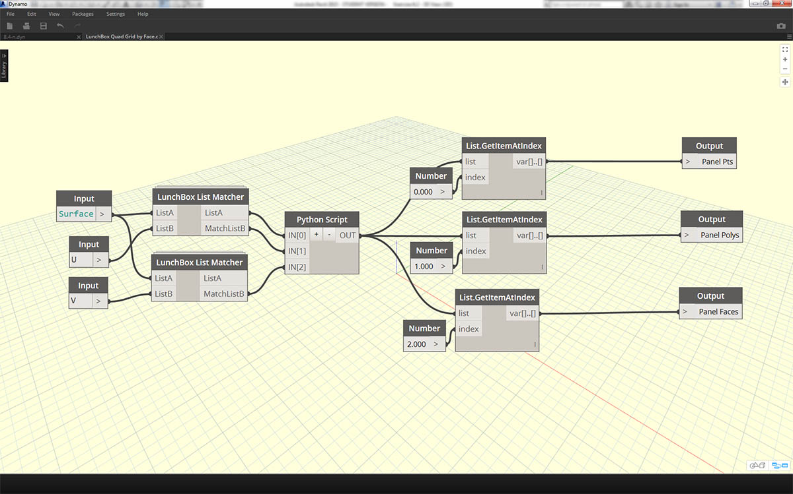
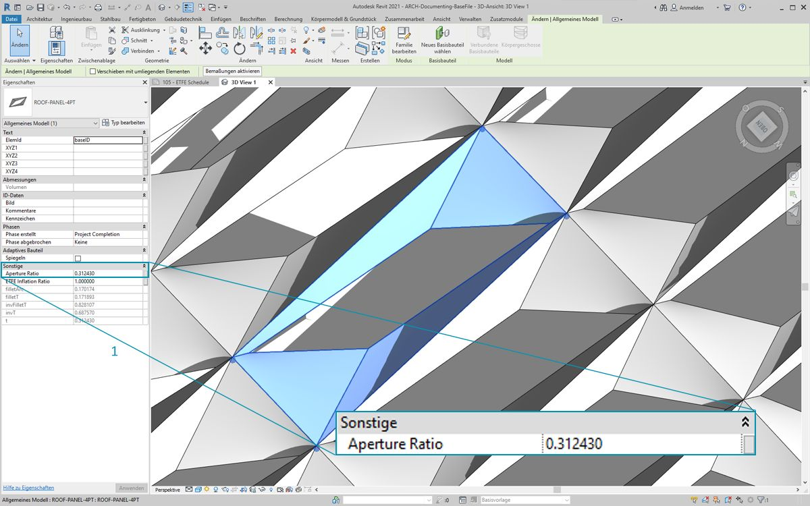
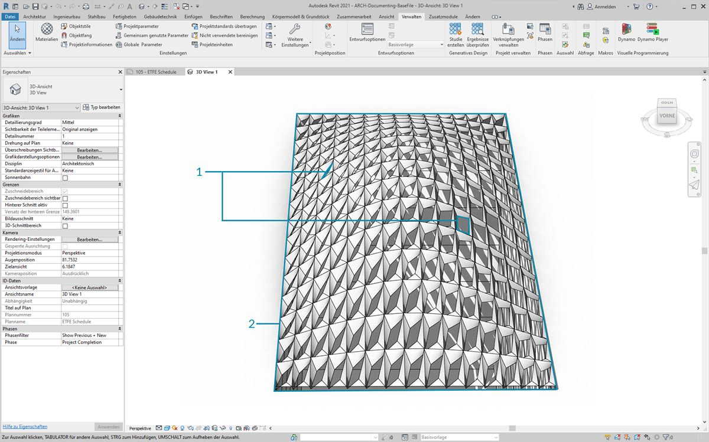

# Anpassen

Bis hierher wurde die Bearbeitung eines einfachen Gebäudekörpers behandelt. Im Folgenden wird die Verknüpfung zwischen Revit und Dynamo am Beispiel der Bearbeitung zahlreicher Elemente in ein und demselben Vorgang ausführlicher erläutert. Anpassungen in größerem Rahmen sind etwas komplizierter, da für die Datenstrukturen komplexere Listenoperationen durchgeführt werden müssen. Deren Ausführung folgt jedoch grundsätzlich denselben Prinzipien. Im Folgenden werden einige Analysemöglichkeiten ausgehend von einer Gruppe adaptiver Bauteile beschrieben.

### Punktposition

Angenommen, Sie haben eine Gruppe adaptiver Bauteile erstellt und möchten deren Parameter anhand ihrer Punktpositionen bearbeiten. Mithilfe dieser Punkte könnten Sie z. B. einen Parameter für die Dicke in Verbindung mit der Fläche des Elements steuern. Oder Sie könnten einen Parameter für die Opazität in Abhängigkeit von der Sonneneinstrahlung im Jahresverlauf steuern. Dynamo ermöglicht die Verbindung zwischen Analysen und Parametern in wenigen einfachen Schritten. Die folgende Übung zeigt eine grundlegende Version hiervon.

> Fragen Sie die adaptiven Punkte eines ausgewählten adaptiven Bauteils mithilfe des _AdaptiveComponent.Locations_-Blocks ab. Dadurch können Sie eine abstrakte Version eines Revit-Elements für die Analyse nutzen.

Indem Sie die Positionen der Punkte adaptiver Bauteile extrahieren, können Sie eine Reihe von Analysen für dieses Element ausführen. Mithilfe eines adaptiven Bauteils mit vier Punkten können Sie beispielsweise die Ebenenabweichung eines gegebenen Dachelements analysieren.

### Analyse der Solarausrichtung

> Ordnen Sie mithilfe der Neuzuordnungsfunktion einen Datensatz einem Parameterbereich zu. Dies ist eines der wichtigsten Werkzeuge für parametrische Modelle, wie in der unten folgenden Übung gezeigt.

In Dynamo können Sie über die Positionen der Punkte von adaptiven Bauteilen eine optimale Ebene für jedes einzelne Element erstellen. Darüber hinaus können Sie den Sonnenstand aus der Revit-Datei abfragen und die Ausrichtung der Ebene relativ zur Sonne mit derjenigen anderer adaptiver Bauteile vergleichen. In der folgenden Übung richten Sie dies ein, indem Sie eine algorithmische Dachform erstellen.

## Übungslektion

> Laden Sie die zu dieser Übungslektion gehörigen Beispieldateien herunter (durch Rechtsklicken und Wahl der Option "Save Link As"). Eine vollständige Liste der Beispieldateien finden Sie im Anhang.

> 1. [Customizing.dyn](https://github.com/h-iL/ForkedDynamoPrimerReorganized/blob/de/08\_Dynamo-for-Revit/datasets/8-5/Customizing.dyn)

1. [ARCH-Customizing-BaseFile.rvt](https://github.com/h-iL/ForkedDynamoPrimerReorganized/blob/de/08\_Dynamo-for-Revit/datasets/8-5/ARCH-Customizing-BaseFile.rvt)

In dieser Übung entwickeln Sie die im vorigen Abschnitt entwickelten Verfahren weiter. In diesem Fall definieren Sie eine parametrische Oberfläche aus Revit-Elementen, instanziieren adaptive Bauteile mit vier Punkten und bearbeiten diese anschließend anhand ihrer Ausrichtung relativ zur Sonne.

.jpg>)

> 1. Beginnen Sie, indem Sie mithilfe eines _Select Edge_-Blocks zwei Kanten auswählen. Die beiden Kanten sind die Längsseiten des Foyers.

1. Fassen Sie die beiden Kanten mithilfe eines _List.Create_-Blocks in einer Liste zusammen.
2. Erstellen Sie mithilfe eines _Surface.ByLoft_-Blocks eine Oberfläche zwischen den beiden Kanten.

.jpg>)

> 1. Definieren Sie in einem _Code Block_ einen Bereich von 0 bis 1 mit 10 gleichmäßig verteilten Werten: `0..1..#10;`.

1. Verbinden Sie den _Code Block_ mit den _u_- und _v_-Eingaben eines _Surface.PointAtParameter_-Blocks und verbinden Sie den _Surface.ByLoft_-Block mit der _surface_-Eingabe. Klicken Sie mit der rechten Maustaste auf den Block und ändern Sie die _Vergitterung_ in _Kartesisches Produkt_. Dadurch erhalten Sie ein Raster aus Punkten auf der Oberfläche.

Die Punkte in diesem Raster werden als Steuerpunkte für eine parametrisch definierte Oberfläche genutzt. Als Nächstes extrahieren Sie die u- und v-Positionen dieser Punkte, damit Sie sie mit einer parametrischen Formel verbinden und dabei die bestehende Datenstruktur beibehalten können. Dies ist durch Abfragen der Parameterpositionen der eben erstellten Punkte möglich.

.jpg>)

> 1. Fügen Sie einen _Surface.ParameterAtPoint_-Block in den Ansichtsbereich ein und verbinden Sie seine Eingaben wie oben gezeigt.

1. Fragen Sie die _u_-Werte dieser Parameter mithilfe eines _UV.U_-Blocks ab.
2. Fragen Sie die _v_-Werte dieser Parameter mithilfe eines _UV.V_-Blocks ab.
3. Die Ausgaben zeigen die _u_- bzw. _v_-Werte der einzelnen Punkte in der Oberfläche. Dadurch erhalten Sie für beide Werte jeweils einen Bereich zwischen _0_ und _1_ in der benötigten Datenstruktur. Jetzt können Sie einen parametrischen Algorithmus anwenden.

.jpg>)

> 1. Fügen Sie im Ansichtsbereich einen _Code Block_ hinzu und geben Sie den folgenden Code ein: `Math.Sin(u*180)*Math.Sin(v*180)*w;`. Mit dieser parametrischen Funktion wird aus der flachen Oberfläche eine durch Sinusfunktionen definierte Wölbung erstellt.

1. Die _u_-Eingabe wird mit _UV.U_ verbunden.
2. Die _v_-Eingabe wird mit _UV.V_ verbunden.
3. Die _w_-Eingabe steht für die _Amplitude_ der Form. Verbinden Sie daher einen _Number Slider_ mit ihr.

.jpg>)

> 1. Dadurch erhalten Sie eine Liste mit durch den Algorithmus definierten Werten. Verwenden Sie diese Werteliste, um die Punkte nach oben, d. h. in _+Z_-Richtung, zu verschieben. Hierfür verwenden Sie _Geometry.Translate_: Verbinden Sie den _Code Block_ mit _zTranslation_ und _Surface.PointAtParameter_ mit der _geometry_-Eingabe. Die neuen Punkte sollten in der Dynamo-Vorschau angezeigt werden.

1. Schließlich erstellen Sie eine Oberfläche, indem Sie den Block aus dem vorigen Schritt mit der points-Eingabe eines _NurbsSurface.ByPoints_-Blocks verbinden. Damit haben Sie eine parametrische Oberfläche erstellt. Wenn Sie den Schieberegler ziehen, können Sie beobachten, wie die Oberfläche sich wölbt und abflacht.

Diese parametrische Oberfläche muss jetzt in Felder unterteilt werden, damit adaptive Bauteile mit vier Punkten darauf angeordnet werden können. Dynamo verfügt nicht über integrierte Funktionen zum Unterteilen von Oberflächen. Suchen Sie daher in der Community nach geeigneten Dynamo-Paketen.

> 1. Wechseln Sie zu _Pakete > Suchen nach Paket_.

1. Suchen Sie nach _LunchBox_ und laden Sie _LunchBox for Dynamo_ herunter. Die hier enthaltenen Werkzeuge sind äußerst hilfreich bei geometrischen Operationen wie dieser.

.jpg>)

> 1. Nach dem Herunterladen haben Sie vollen Zugriff auf die LunchBox-Suite. Suchen Sie nach _Quad Grid_ und wählen Sie _LunchBox Quad Grid By Face_. Verbinden Sie die parametrische Oberfläche mit der _surface_-Eingabe und legen Sie als Unterteilungen für _U_ und _V_ jeweils _15_ fest. In der Dynamo-Vorschau sollte jetzt eine in viereckige Elemente unterteilte Oberfläche zu sehen sein.

> Wenn Sie an der Programmstruktur des _LunchBox_-Blocks interessiert sind, können Sie sie durch Doppelklicken auf den Block anzeigen.

.jpg>)

> Kehren Sie zu Revit und zum hier verwendeten adaptiven Bauteil zurück. Ohne allzu sehr ins Einzelne zu gehen: Dies ist das zu instanziierende Dachelement. Dieses adaptive Bauteil mit vier Punkten ist eine grobe Darstellung eines EFTE-Systems. Die Öffnung des Abzugskörpers in der Mitte wird durch einen Parameter namens _ApertureRatio_ gesteuert.

.jpg>)

> 1. Da hier große Mengen von Geometrie in Revit instanziiert werden, achten Sie darauf, den Dynamo-Solver auf _Manuell_ einzustellen.

1. Fügen Sie im Ansichtsbereich einen _Family Types_-Block ein und wählen Sie _"ROOF-PANEL-4PT"_.
2. Fügen Sie im Ansichtsbereich einen _AdaptiveComponent.ByPoints_-Block ein und verbinden Sie die _Panel Pts_-Ausgabe des _LunchBox Quad Grid by Face_-Blocks mit der _points_-Eingabe. Verbinden Sie den _Family Types_-Block mit der _familySymbol_-Eingabe.
3. Klicken Sie auf _Ausführen_. Revit benötigt etwas _Zeit_ zum Erstellen der Geometrie. Wenn dies zu lange dauert, reduzieren Sie den _Codeblock-Wert 15_ auf eine kleinere Zahl. Dadurch erhalten Sie weniger Elemente auf dem Dach.

_Anmerkung: Falls die Berechnung von Blöcken in Dynamo sehr lange dauert, können Sie die Blockfunktionen anhalten ("einfrieren") und damit die Ausführung von Revit-Vorgängen unterbrechen, während Sie Ihr Diagramm entwickeln. Weitere Informationen zum Anhalten von Blöcken finden Sie im entsprechenden Abschnitt im Kapitel_ [_Körper_](../5\_geometry-for-computational-design/5-6\_solids.md#freezing)_._

.jpg>)

> In Revit sind die Elemente jetzt auf dem Dach angeordnet.

> Wenn Sie die Ansicht vergrößern, erhalten Sie einen genaueren Eindruck der Eigenschaften der Oberfläche.

## Analyse

> 1. Als Nächstes entwickeln Sie dies weiter, um die Öffnung der einzelnen Elemente in Abhängigkeit von der Sonneneinstrahlung an seiner Position zu steuern. Wenn Sie die Darstellung in Revit vergrößern und eines der Elemente auswählen, wird in der Eigenschaftenleiste der Parameter _Aperture Ratio_ angezeigt. Die Familie wurde so eingerichtet, dass Öffnungsgrade zwischen ungefähr _0.05_ und _0.45_ möglich sind.

> 1. Wenn Sie die Sonnenbahn aktivieren, wird der aktuelle Sonnenstand in Revit angezeigt.

.jpg>)

> 1. Diesen Sonnenstand können Sie mithilfe des _SunSettings.Current_-Blocks referenzieren.

1. Verbinden Sie die Sonneneinstellungen mit _Sunsetting.SunDirection_, um den Solarvektor zu erhalten.
2. Erstellen Sie ausgehend von den _Panel Pts_, aus denen Sie die adaptiven Bauteile erstellt haben, mithilfe von _Plane.ByBestFitThroughPoints_ annähernde Ebenen für die Bauteile.
3. Rufen Sie die _normal_ für diese Ebene ab.
4. Berechnen Sie mithilfe des _Skalarprodukts_ die Sonnenrichtung. Das Skalarprodukt ist eine Formel zur Bestimmung der Parallelität oder Antiparallelität zweier Vektoren. Sie vergleichen also die Ebenennormale jedes einzelnen adaptiven Bauteils mit dem Solarvektor, um eine ungefähre Simulation des Winkels gegenüber der Sonnenstrahlung zu erhalten.
5. Ermitteln Sie _absoluten Wert_ des Ergebnisses. Dadurch wird die Richtigkeit des Skalarprodukts für den Fall sichergestellt, dass die Ebenennormale in die entgegengesetzte Richtung zeigt.
6. Klicken Sie auf _Ausführen_.

.jpg>)

> 1. Für das _Skalarprodukt_ wird ein großer Zahlenbereich ausgegeben. Die relative Verteilung dieser Zahlen soll verwendet werden, ihr Bereich muss jedoch auf den geeigneten Bereich für den Parameter _Aperture Ratio_, der bearbeitet werden soll, verdichtet werden.

1. Hierfür ist _Math.RemapRange_ hervorragend geeignet. Diese Funktion übernimmt eine eingegebene Liste und ordnet ihre Grenzwerte zwei Zielwerten zu.
2. Definieren Sie die Zielwerte _0.15_ und _0.45_ in einem _Code Block_.
3. Klicken Sie auf _Ausführen_.

.jpg>)

> 1. Verbinden Sie die neu zugeordneten Werte mit einem _Element.SetParameterByName_-Block.

1. Verbinden Sie die Zeichenfolge _"Aperture Ratio"_ mit der _parameterName_-Eingabe.
2. Verbinden Sie die _adaptiven Bauteile_ mit der _element_-Eingabe.
3. Klicken Sie auf _Ausführen_.

> In Revit ist die Auswirkung des Sonnenwinkels auf die Öffnung der EFTE-Elemente auch aus größerer Entfernung zu erkennen.

> Wenn Sie die Ansicht vergrößern, ist zu sehen, dass die der Sonne zugewandten EFTE-Elemente stärker geschlossen sind. In diesem Fall soll eine Überhitzung durch Sonneneinstrahlung vermieden werden. Wenn Sie den Lichteinfall in Abhängigkeit von der Sonneneinstrahlung steuern wollten, könnten Sie dafür einfach die Domäne im _Math.RemapRange_-Block ändern.
